# MRI research: conference writing package

An audited study of quality conditioning for MRI segmentation with missing modalities, with a separate classification benchmark. The repository contains completed Kaggle experiments, **20 verified visualizations**, a manuscript starter, editable tables and the evidence needed to trace every reported result.

[Research questions](#research-questions-and-answers) · [Architecture](#architecture) · [Ablations](#ablation-studies) · [Results](#reserved-results) · [Manuscript](docs/MANUSCRIPT_DRAFT.md) · [Complete release v1.2.0](https://github.com/Hisernberg/mri-conference-research/releases/tag/v1.2.0)

**Main finding:** the completed reserved evaluation favors removing quality features. The package preserves negative results, inconclusive comparisons and failure cases. These internal experiments do not establish patient-level external validation, architectural novelty or conference acceptance.

## Architecture


**Original, source-verified architecture plate.** [Editable SVG](docs/figures/qmmf_architecture.svg) · [Vector PDF](docs/figures/qmmf_architecture.pdf) · [High-resolution PNG](docs/figures/qmmf_architecture.png) · [Enlarged fusion detail](docs/figures/qmmf_fusion_detail.pdf) · [Two-page plate](docs/figures/architecture_plate.pdf) · [Full methods and caption](docs/ARCHITECTURE.md).

The diagram follows the submitted Kaggle implementation and resolved configuration: **1,221,465 parameters**, encoder widths **24 / 48 / 96 / 160**, five-slice context, and three overlapping region outputs. A synthetic forward pass verified the displayed tensor shapes and the two training-only auxiliary heads. Anatomical icons are schematic. This explanatory plate is separate from the 20 verified Kaggle result visualizations below.

Visual references are the annotated module diagrams in [Sebastian Raschka's architecture comparison](https://magazine.sebastianraschka.com/p/the-big-llm-architecture-comparison), the explicit scale/skip layout in [U-Net Figure 1](https://arxiv.org/pdf/1505.04597), and the feature/statistic separation in [HeMIS Figure 1](https://arxiv.org/pdf/1607.05194). The artwork is an original composition; these references do not imply endorsement or architectural equivalence.

## Novelty and contributions

**Research hypothesis:** seven per-sequence quality proxies might improve missing-modality segmentation when they condition learned gates over multi-scale feature statistics. The implemented combination uses pooled features, quality descriptors and modality identity to weight the available inputs. Statistical modality fusion is established in [HeMIS](https://arxiv.org/abs/1607.05194), and dynamic modality weighting is studied in [SimMLM](https://arxiv.org/abs/2507.19264). The focused literature review does not establish a first-of-its-kind architecture.

The defensible contributions of the completed work are:

1. **An audited benchmark and repaired implementation.** Identify rescaled copies among 484 canonical segmentation cases, construct 262 conservative similarity groups, and correct modality order, inference normalization/geometry, training-fitted quality scaling, full-input teacher data and the shuffled-quality control. [Audit](docs/NOTEBOOK_AUDIT.md) · [data provenance](docs/DATASETS.md).
2. **A controlled negative result for quality conditioning.** Compare nine variants across three seeds, including no-quality and shuffled-quality controls, then retain all four prespecified families in reserved evaluation. Removing quality improves all three declared reserved endpoints under the recorded paired adjustment. [Development ablations](#ablation-studies) · [reserved contrasts](paper/tables/reserved_contrasts.md).
3. **A detailed robustness and failure analysis.** Evaluate all 15 nonempty modality combinations, report case-specific worst-subset performance and empty-reference ET false positives, and examine a historically less-exposed subset with its uncertainty. [Figures 14–18](docs/FIGURE_CATALOG.md) · [historical audit](audit/historical_exposure_sensitivity_protocol.json).
4. **A reproducible writing and experiment package.** Preserve exact Kaggle source/version records, 20 executed result figures with plotted data, editable tables, manuscript files, architecture sources and measured cache/resource costs. [Kaggle index](kaggle/README.md) · [claim-evidence map](paper/claim_evidence.csv).

The contribution is a bounded empirical study of the added quality signal. A general quality-conditioning benefit, superiority over current published methods, or clinical utility is not established by these results.

## Research questions and answers

These questions organize the completed evidence for writing. Their wording was added after the experiments; the original dated [plan](EXPERIMENT_PLAN.md) and frozen protocols establish the actual prespecified comparisons.

| Research question | Implemented test / solution | Answer supported by the completed evidence |
|---|---|---|
| **RQ1. Do quality descriptors add value?** | Remove quality from the gate; separately assign descriptors from a different training group while preserving the QMMF family. | Main no-quality contrasts are uncertain after adjustment; all three reserved contrasts favor removing quality. Aligned quality beats shuffled quality on the main worst-subset endpoint, without establishing benefit over omitting quality. |
| **RQ2. Do learned moments outperform simpler fusion at similar capacity?** | Remove the dispersion or maximum branch; compare with widened equal-weight mean/dispersion fusion. | Neither single-branch removal establishes a QMMF advantage. The capacity-matched control has higher main worst-subset Dice under the declared adjustment. |
| **RQ3. Does EMA subset consistency help?** | Set the consistency coefficient to zero; retain the encoder, fusion, decoder and auxiliary heads. | Main mean-subset Dice favors consistency by 0.0050, adjusted interval [0.0015, 0.0102]. Full and worst-subset contrasts remain uncertain; no reserved no-consistency run was performed. |
| **RQ4. How robust are predictions to missing inputs and empty lesions?** | Evaluate every nonempty modality subset and separately measure predictions where reference ET is empty. | No quality has higher descriptive mean Dice in all 15 reserved combinations. Both ET-empty cases receive false-positive ET predictions from every model/seed. |
| **RQ5. Does the finding persist outside the original development partition?** | Apply the frozen historical-exposure sensitivity to 18 cases in 15 reserved groups. | Full and mean-subset comparisons are uncertain; worst-subset Dice still favors no quality. This nested, exploratory sensitivity is not an independent replication. |

## Implemented solution

**Input and shared encoding.** Verify the T1/T1ce/T2/FLAIR order, preprocess the complete four-channel volume, extract five-slice windows and apply the availability mask. A shared 5×3×3 convolution mixes adjacent slices, followed by modality-identity FiLM and in-plane refinement. Three average-pooling stages yield four per-modality feature scales. Training uses 192×192 crops; inference preserves the full brain field of view.

**Quality-conditioned fusion.** At each scale, concatenate globally pooled features, seven normalized quality proxies and a learned 16-value modality embedding. A 32-unit MLP and masked softmax produce one scalar weight per available modality. Concatenate the weighted mean, square-root weighted variance and available-feature maximum; project them with a 1×1 convolution, GroupNorm and GELU. Absent modalities are excluded from both the gate and maximum. The quality scaler is fitted only on training groups. [Fusion equations, proxy definitions and source mapping](docs/ARCHITECTURE.md).

**Segmentation and training.** Two factorized large-kernel residual blocks supply bottleneck context. Bilinear decoder stages combine the fused skip features and predict WT (whole tumor), TC (tumor core) and ET (enhancing tumor). Inference reconstructs native-volume probabilities, applies nested-region projection and thresholds at 0.5. Training combines Dice/BCE, boundary and nesting terms, two auxiliary heads, and confidence-masked consistency with an EMA teacher receiving all four modalities. The reserved results support the **no-quality version** as the stronger of these two evaluated systems under this protocol.

## Evaluation protocol

| Segmentation role, development fold 0 | Cases | Conservative groups | Use |
|---|---:|---:|---|
| Training | 294 | 132 | Fitting; group-based sampling and quality normalization |
| Inner selection | 33 | 24 | 12 fixed group representatives used for checkpoint scoring |
| Outer development | 91 | 55 | Full-modality evaluation; all subsets on 16 fixed representatives |
| Reserved evaluation | 66 | 51 | Selected checkpoints; all subsets on 51 fixed representatives |

All 27 main fits use seeds **42 / 43 / 44**, **120 epochs × 100 microbatches**, batch size **4**, accumulation **2**, and AdamW (learning rate **0.0003**, weight decay **0.001**). Each fit has 6,000 scheduled optimizer-step opportunities. Checkpoints are scored every ten epochs on the declared inner-selection cohort. Three seeds repeat one partition; this is not three-fold or four-fold cross-validation. [Resolved configuration](results/segmentation_study_s42/protocol_lock.json).

- **Full Dice:** calculate each case's macro Dice over nonempty reference regions, average cases within each similarity group, then weight groups equally. Region-specific denominators differ: reserved WT/TC use 66 cases; ET uses 64. Empty-reference failures are reported separately.
- **Mean/worst-subset Dice:** average, or take the minimum, over all 15 nonempty subsets **within each fixed representative**, then average groups. The all-four subset column uses representatives and therefore differs from the all-case full-modality headline.
- **Uncertainty:** report mean ± sample SD over the three fixed seeds. Paired bootstrap intervals resample groups 10,000 times while retaining all three seeds. Bonferroni adjustment covers eight controls per endpoint in the main study and three per endpoint in reserved evaluation. It does not cover all endpoints and exploratory figures as one family.

Conservative similarity groups are not verified patient identities. Missingness is simulated after complete-modality preprocessing. Seven reserved groups contain earlier notebook-validation cases; retain the full results and the separately labeled historical sensitivity. [Detailed evaluation and limitations](docs/RESULTS.md).

## Start writing

| Need | Open this |
|---|---|
| A structured paper with actual results | [Manuscript Markdown](docs/MANUSCRIPT_DRAFT.md), [editable DOCX](docs/docx/MANUSCRIPT_DRAFT.docx), [review PDF](docs/pdf/MANUSCRIPT_DRAFT.pdf) |
| Figure captions and interpretation limits | [Figure catalog](docs/FIGURE_CATALOG.md), [catalog PDF](docs/pdf/FIGURE_CATALOG.pdf), [20-page figure atlas](results/conference_figures/conference_figure_atlas.pdf) |
| Figures as shown in the executed notebook | [Executed Kaggle gallery](results/conference_figures/03_conference_visualizations.executed.ipynb) |
| Tables for a conference template | [Eight table sets: CSV / Markdown / LaTeX](paper/tables/) |
| Statements tied to evidence | [Claim-evidence map](paper/claim_evidence.csv), [writing guide](docs/WRITING_GUIDE.md) |
| Citations and positioning | [BibTeX references](paper/references.bib), [related-work report](docs/RELATED_WORK.md) |
| Architecture and precise implementation details | [Methods and captions](docs/ARCHITECTURE.md), [methods PDF](docs/pdf/ARCHITECTURE.pdf), [editable vector plates](docs/figures/) |
| Dataset and original-notebook analysis | [Dataset report](docs/DATASETS.md), [notebook audit](docs/NOTEBOOK_AUDIT.md), [experiment plan](EXPERIMENT_PLAN.md) |

No venue or page limit has been supplied. The draft is venue-neutral, with a suggested main-paper selection and all 20 figures available for the supplement. Authors still need to provide their identities, institutional declarations, source-code licensing decision and venue formatting.

## Completed experiments

| Study | Completed scope | Sampling units |
|---|---|---|
| Classification | 7 variants × 5 grouped folds × 3 seeds = **105 fits** | 228 unique images / 209 conservative groups |
| Corrected segmentation pilot | **3 fits** | Short-training feasibility evidence |
| Main segmentation | 9 variants × 3 seeds = **27 fits** | Development fold 0; 91 outer cases / 55 groups; 16 subset representatives |
| Reserved segmentation | 4 families × 3 checkpoints = **12 evaluations** | 66 cases / 51 groups; all 15 subsets on 51 representatives |
| Conference visualization | **20 figures**, 21 executed gallery code cells | Kaggle CPU, version 1; no new training or inference |

All original run URLs and exact versions are in the [Kaggle index](kaggle/README.md). The [new visualization notebook](https://www.kaggle.com/code/dasshovon/mri-conference-20-visualizations) completed on Kaggle CPU. Its input/output hashes, plotted CSV values and all 20 embedded image outputs were [independently verified](audit/conference_visualizations_verification.json).

## Ablation studies

All rows below completed **three main-development fits** with the common budget and partition. Values are mean ± sample SD. Full Dice uses 55 outer groups; subset endpoints use the same 16 fixed representatives. The implementation-change column identifies the actual intervention.

| Variant | Change from QMMF / comparator | Full Dice | Mean-subset Dice | Worst-subset Dice |
|---|---|---|---|---|
| QMMF | Reference: quality gate, mean + dispersion + max, consistency | 0.8052 ± 0.0028 | 0.6492 ± 0.0059 | 0.3407 ± 0.0184 |
| No quality | Omit q from the gate; keep pooled features, identity and learned gating | 0.8106 ± 0.0042 | 0.6551 ± 0.0081 | 0.3537 ± 0.0197 |
| Shuffled quality | Assign descriptors from a different training group | 0.8044 ± 0.0008 | 0.6455 ± 0.0060 | 0.3246 ± 0.0323 |
| Matched moment fusion | Equal available weights; mean + dispersion; widths 24/48/96/168 | 0.8098 ± 0.0032 | 0.6548 ± 0.0023 | 0.3591 ± 0.0107 |
| No variance | Remove the square-root variance branch | 0.8073 ± 0.0011 | 0.6512 ± 0.0068 | 0.3462 ± 0.0042 |
| No max | Remove the available-feature maximum branch | 0.8066 ± 0.0032 | 0.6528 ± 0.0077 | 0.3423 ± 0.0135 |
| No consistency | Set consistency weight to 0; no EMA teacher | 0.8043 ± 0.0038 | 0.6441 ± 0.0052 | 0.3394 ± 0.0082 |
| HeMIS-style | Local alternative architecture; no auxiliary heads | 0.7072 ± 0.0060 | 0.5403 ± 0.0039 | 0.2338 ± 0.0249 |
| U-Net 2.5D | Local early-concatenation architecture; no auxiliary heads | 0.7865 ± 0.0105 | 0.6107 ± 0.0093 | 0.2912 ± 0.0196 |

**Interpretation:** all main no-quality, no-variance and no-max adjusted contrasts include zero. QMMF exceeds shuffled quality on worst-subset Dice by **0.0161 [0.0009, 0.0326]**; their full and mean-subset contrasts remain uncertain. This shows a worse outcome with mismatched training descriptors, without establishing an advantage over omitting descriptors. The matched-moment control improves worst-subset Dice: QMMF minus control **−0.0184**, adjusted interval **[−0.0335, −0.0035]**. Consistency improves mean-subset Dice by **0.0050 [0.0015, 0.0102]**, while its other two contrasts remain uncertain. [Exact paired contrasts](results/segmentation_main/paired_repeated_seed_deltas.csv) · [editable score table](paper/tables/main_segmentation.md).

**Comparison limits:** QMMF and its six same-family controls retain two auxiliary heads (weights 0.5 and 0.25); HeMIS-style and U-Net have none. Their contrasts compare architecture and effective objective together. No quality removes 896 gate parameters (1,220,569 total); the widened moment control has 1,227,977 parameters, approximately 0.53% above QMMF. These are measured counts, not an exact parameter match. [Effective-objective audit](results/implementation_audit/effective_objectives.csv) · [resources](paper/tables/resources.md).

Other ablations present in the broader configuration registry, such as context-kernel, FiLM or slice-depth sweeps, were **not executed in this nine-variant main matrix**. Four families were prespecified for reserved evaluation; the reserved set was not expanded after seeing development rankings.

## Reserved results

| Model | Full Dice | Mean-subset Dice | Worst-subset Dice |
| --- | --- | --- | --- |
| QMMF | 0.7689 +/- 0.0055 | 0.6322 +/- 0.0080 | 0.3672 +/- 0.0120 |
| No quality | 0.7769 +/- 0.0007 | 0.6405 +/- 0.0075 | 0.3886 +/- 0.0137 |
| HeMIS-style | 0.6837 +/- 0.0007 | 0.5462 +/- 0.0080 | 0.2748 +/- 0.0286 |
| U-Net 2.5D | 0.7621 +/- 0.0074 | 0.6034 +/- 0.0078 | 0.3140 +/- 0.0115 |

Values are mean +/- sample SD across the three fixed seeds. Full Dice uses 66 cases grouped into 51 units; subset metrics use 51 fixed representatives. QMMF minus no quality is **-0.0080**, adjusted paired group interval **[-0.0133, -0.0028]**, for full modalities. The mean- and worst-subset comparisons also favor no quality. See [all results](docs/RESULTS.md) and [the paired table](paper/tables/reserved_contrasts.md).

| QMMF minus no quality | Mean difference | Adjusted paired group interval | Supported interpretation |
|---|---:|---|---|
| Full modalities | −0.0080 | [−0.0133, −0.0028] | Favors removing quality |
| Mean over subsets | −0.0083 | [−0.0124, −0.0042] | Favors removing quality |
| Worst subset per representative | −0.0214 | [−0.0322, −0.0119] | Favors removing quality |

The exploratory 15-group historical sensitivity leaves full and mean-subset differences uncertain; the worst-subset interval remains negative (**−0.0178 [−0.0437, −0.0016]**). Both ET-empty reserved cases have false-positive ET predictions for all four models and all three seeds. These observations belong in the paper's results and discussion, alongside the primary scores. [Historical sensitivity](paper/tables/historical_sensitivity.md) · [empty-reference results](results/conference_figures/data/fig17_empty_reference_et_failures.csv).

## Separate classification benchmark and computation

The classification task uses **228 unique images in 209 conservative groups**, with seven variants × five grouped folds × three seeds (**105 fits**). The full configuration achieves macro-F1 **0.7745 ± 0.0237** and mean AUROC **0.8457**. Its macro-F1 difference from the narrow-ResNet control is **0.0326**, with descriptive interval **[−0.0120, 0.0767]**; this does not establish a reliable gain. This image-level task is separate from segmentation and does not validate patient-level diagnosis. [Classification table](paper/tables/classification.md) · [paired contrasts](results/classification/paired_ablation_deltas.csv).

On Kaggle T4, QMMF's median fitting/inner-validation component was **69.92 minutes**, with maximum observed peak allocated memory **1.347 GiB** across seeds. A bounded cache benchmark measured **4.02×** QMMF training-segment throughput after lossless staging (10 warmup and 100 timed microbatches). This is not a whole-experiment speedup or a repeated-run timing interval. [Resource table](paper/tables/resources.md) · [Figure 20 evidence](results/conference_figures/data/fig20_cache_throughput.csv).

## Twenty figures from the Kaggle report

Each figure has PNG, PDF, SVG and a plotted-data CSV. Click its caption link for the complete interpretation and source files. Figures 01–18 and 20 are chart exports with vector PDF/SVG elements. Figure 19 preserves the original real-prediction montage; its SVG wraps the original raster. The [figure atlas](results/conference_figures/conference_figure_atlas.pdf) contains all 20 PDF pages.

### Suggested main-paper figures

**Figure 02. Frozen segmentation cohorts** — [caption and evidence](docs/FIGURE_CATALOG.md) · [PDF](results/conference_figures/fig02_segmentation_cohorts.pdf) · [CSV](results/conference_figures/data/fig02_segmentation_cohorts.csv)


**Figure 08. Main paired ablation intervals** — [caption and evidence](docs/FIGURE_CATALOG.md) · [PDF](results/conference_figures/fig08_main_paired_ablations.pdf) · [CSV](results/conference_figures/data/fig08_main_paired_ablations.csv)


**Figure 11. Reserved evaluation: four selected model families** — [caption and evidence](docs/FIGURE_CATALOG.md) · [PDF](results/conference_figures/fig11_reserved_segmentation_endpoints.pdf) · [CSV](results/conference_figures/data/fig11_reserved_segmentation_endpoints.csv)


**Figure 14. All reserved modality subsets** — [caption and evidence](docs/FIGURE_CATALOG.md) · [PDF](results/conference_figures/fig14_reserved_modality_subsets.pdf) · [CSV](results/conference_figures/data/fig14_reserved_modality_subsets.csv)


**Figure 18. Historical exposure sensitivity** — [caption and evidence](docs/FIGURE_CATALOG.md) · [PDF](results/conference_figures/fig18_historical_exposure_sensitivity.pdf) · [CSV](results/conference_figures/data/fig18_historical_exposure_sensitivity.csv)


**Figure 19. Prespecified qualitative predictions** — [caption and evidence](docs/FIGURE_CATALOG.md) · [PDF](results/conference_figures/fig19_prespecified_qualitative.pdf) · [CSV](results/conference_figures/data/fig19_prespecified_qualitative.csv)


<details>
<summary><strong>Data audit and separate classification benchmark</strong></summary>

**Figure 01. Dataset audit** — [caption and evidence](docs/FIGURE_CATALOG.md) · [PDF](results/conference_figures/fig01_dataset_audit.pdf) · [CSV](results/conference_figures/data/fig01_dataset_audit.csv)

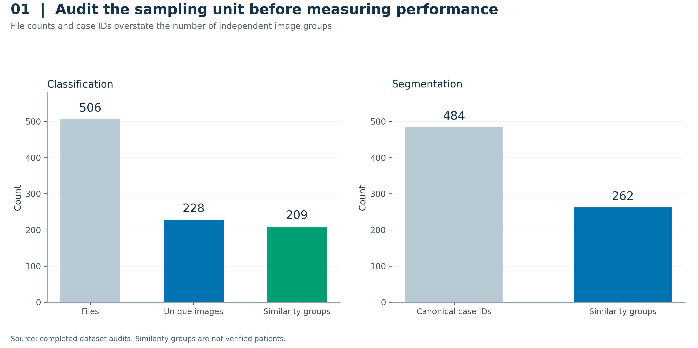

**Figure 03. Classification ablation summary** — [caption and evidence](docs/FIGURE_CATALOG.md) · [PDF](results/conference_figures/fig03_classification_ablations.pdf) · [CSV](results/conference_figures/data/fig03_classification_ablations.csv)

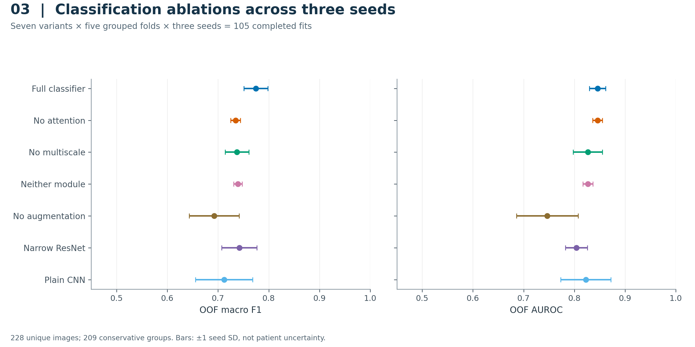

**Figure 04. Classification ROC and precision–recall** — [caption and evidence](docs/FIGURE_CATALOG.md) · [PDF](results/conference_figures/fig04_classification_roc_pr.pdf) · [CSV](results/conference_figures/data/fig04_classification_roc_pr.csv)

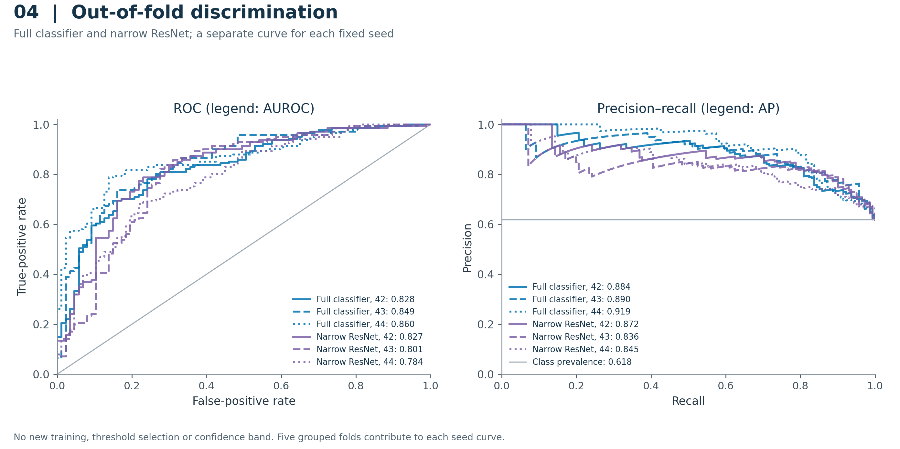

**Figure 05. Classification confusion matrices** — [caption and evidence](docs/FIGURE_CATALOG.md) · [PDF](results/conference_figures/fig05_classification_confusion.pdf) · [CSV](results/conference_figures/data/fig05_classification_confusion.csv)

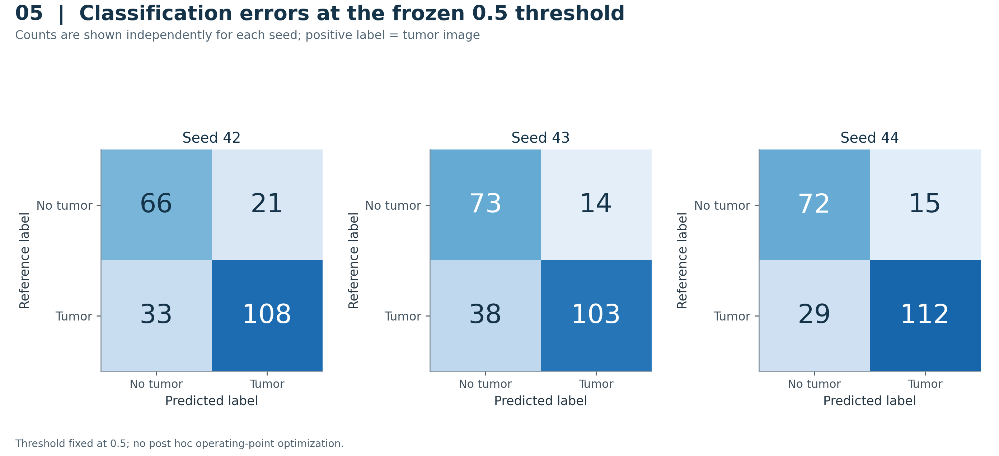

**Figure 06. Paired classification contrasts** — [caption and evidence](docs/FIGURE_CATALOG.md) · [PDF](results/conference_figures/fig06_classification_paired_contrasts.pdf) · [CSV](results/conference_figures/data/fig06_classification_paired_contrasts.csv)

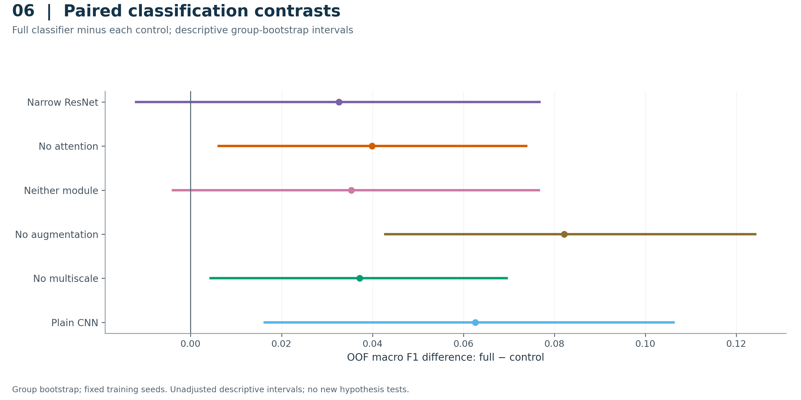

</details>

<details>
<summary><strong>Development results and optimization diagnostics</strong></summary>

**Figure 07. Main segmentation: all nine variants** — [caption and evidence](docs/FIGURE_CATALOG.md) · [PDF](results/conference_figures/fig07_main_segmentation_endpoints.pdf) · [CSV](results/conference_figures/data/fig07_main_segmentation_endpoints.csv)

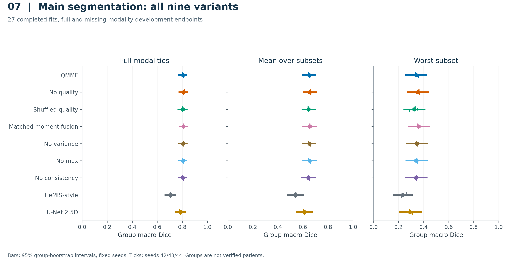

**Figure 09. Training selection curves** — [caption and evidence](docs/FIGURE_CATALOG.md) · [PDF](results/conference_figures/fig09_training_selection_curves.pdf) · [CSV](results/conference_figures/data/fig09_training_selection_curves.csv)

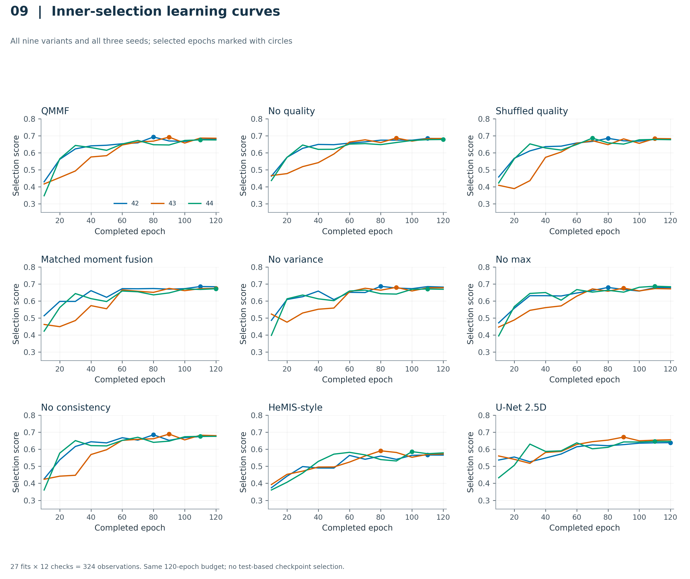

**Figure 10. Segmentation capacity and compute** — [caption and evidence](docs/FIGURE_CATALOG.md) · [PDF](results/conference_figures/fig10_segmentation_compute.pdf) · [CSV](results/conference_figures/data/fig10_segmentation_compute.csv)

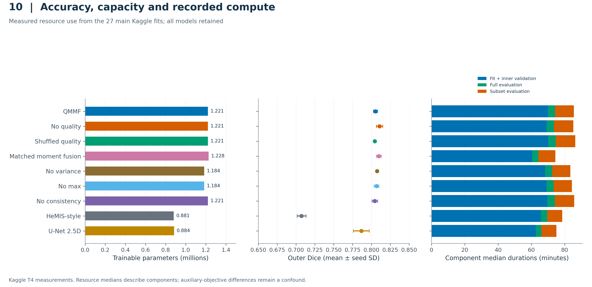

**Figure 20. Lossless cache throughput** — [caption and evidence](docs/FIGURE_CATALOG.md) · [PDF](results/conference_figures/fig20_cache_throughput.pdf) · [CSV](results/conference_figures/data/fig20_cache_throughput.csv)

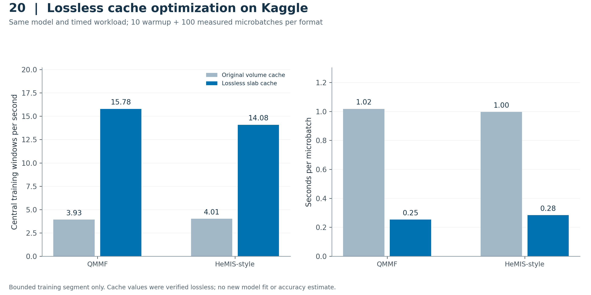

</details>

<details>
<summary><strong>Additional reserved comparisons, attribution and failures</strong></summary>

**Figure 12. Reserved paired comparisons** — [caption and evidence](docs/FIGURE_CATALOG.md) · [PDF](results/conference_figures/fig12_reserved_paired_contrasts.pdf) · [CSV](results/conference_figures/data/fig12_reserved_paired_contrasts.csv)

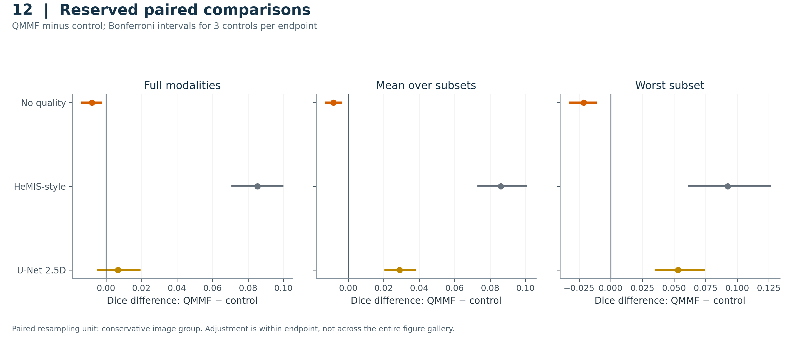

**Figure 13. Reserved regional Dice** — [caption and evidence](docs/FIGURE_CATALOG.md) · [PDF](results/conference_figures/fig13_reserved_regional_dice.pdf) · [CSV](results/conference_figures/data/fig13_reserved_regional_dice.csv)

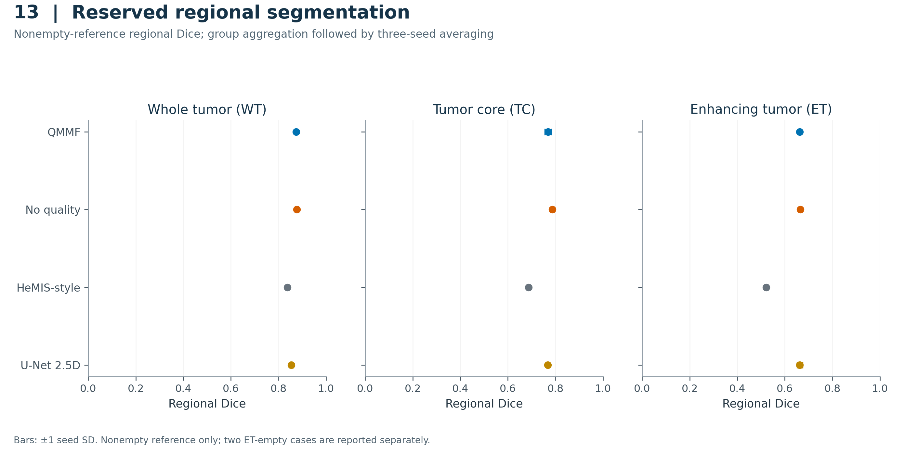

**Figure 15. Reserved modality Shapley contributions** — [caption and evidence](docs/FIGURE_CATALOG.md) · [PDF](results/conference_figures/fig15_reserved_modality_shapley.pdf) · [CSV](results/conference_figures/data/fig15_reserved_modality_shapley.csv)

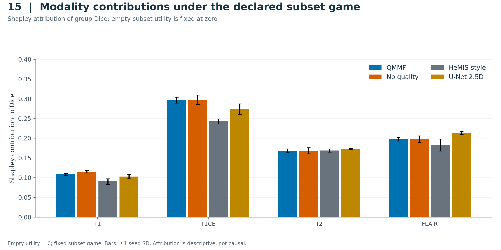

**Figure 16. Reserved group heterogeneity** — [caption and evidence](docs/FIGURE_CATALOG.md) · [PDF](results/conference_figures/fig16_reserved_group_heterogeneity.pdf) · [CSV](results/conference_figures/data/fig16_reserved_group_heterogeneity.csv)

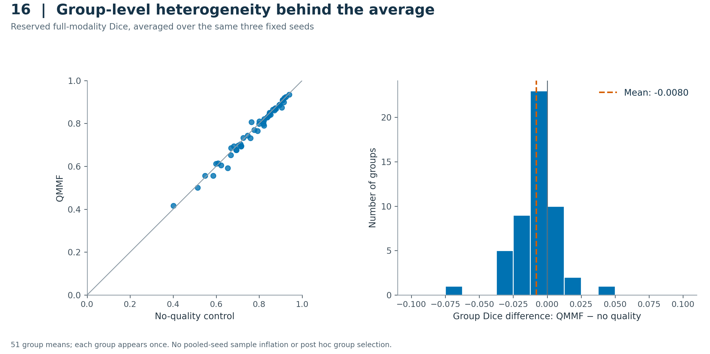

**Figure 17. Empty-reference ET failures** — [caption and evidence](docs/FIGURE_CATALOG.md) · [PDF](results/conference_figures/fig17_empty_reference_et_failures.pdf) · [CSV](results/conference_figures/data/fig17_empty_reference_et_failures.csv)


</details>

## Limits that belong in the paper

- Similarity groups are not verified patients. The repaired grouping addresses observed copies, not every possible patient relationship.
- Seven reserved groups include earlier notebook validation cases. The 15-group historical sensitivity is exploratory and overlaps the complete cohort.
- Missing modalities are masked after complete-modality preprocessing; this does not validate an acquisition workflow that never obtained those sequences.
- Main training uses one development fold and three fixed seeds. Group intervals and seed SD are different quantities.
- Cross-family comparisons include auxiliary-objective differences. Same-family controls provide closer tests of the quality contribution.
- Both ET-empty cases receive false-positive ET from every model and seed. Figure 17 retains those failures.

## Notebooks and reproducibility

| Notebook | Purpose |
|---|---|
| [01 — classification ablations](notebooks/01_classification_ablation.ipynb) | Original completed 105-fit research source |
| [02 — segmentation study](notebooks/02_segmentation_study.ipynb) | Original completed main-study research source |
| [03 — conference visualizations](notebooks/03_conference_visualizations.ipynb) | Supporting Kaggle CPU report, with private evidence-dataset attachment |
| [Executed visualization gallery](results/conference_figures/03_conference_visualizations.executed.ipynb) | Actual Kaggle output notebook with all 20 figures and captions |

Install the declared dependencies in a suitable Python environment. Rebuild figures into a separate local output directory to preserve the verified Kaggle exports:

```bash
python -m pip install -r requirements-dev.txt
PYTHONPATH=segmentation/src python -m pytest tests segmentation/tests -q
python scripts/build_conference_figures.py --output runtime/figure_rebuild
python scripts/build_architecture_diagrams.py --output runtime/architecture_rebuild
python scripts/build_paper_tables.py
```

The original verification suite contains 186 tests. Figure validation additionally checks source hashes, complete model/seed/cohort coverage, plotted values and actual notebook image bytes. Detailed execution instructions are in the [notebook index](notebooks/README.md) and [operation guide](docs/NOTEBOOKS.md).

## Repository and access

Source lives in `classification/` and `segmentation/`; `notebooks/` contains portable notebook sources; `kaggle/` indexes deployment bundles; `results/` contains verified evidence; `docs/` contains Markdown, DOCX and PDF reports; `paper/` contains writing tables, references and the claim map; `audit/` preserves provenance.

The GitHub repository is public. Kaggle jobs remain private under `dasshovon` and require the appropriate account or collaborator access. Credentials, raw MRI volumes, image datasets and checkpoints are excluded from Git history. Dataset/checkpoint access remains documented through Kaggle. Preserve [the montage attribution](results/conference_figures/ATTRIBUTION.md) with its figures; it does not grant a license to the entire codebase.

[Download v1.2.0 architecture and research narrative](https://github.com/Hisernberg/mri-conference-research/releases/tag/v1.2.0) · [Preserved v1.1.0 writing package](https://github.com/Hisernberg/mri-conference-research/releases/tag/v1.1.0) · [Preserved v1.0.0 experiments](https://github.com/Hisernberg/mri-conference-research/releases/tag/v1.0.0) · [GitHub release guide](docs/GITHUB_RELEASE.md)
