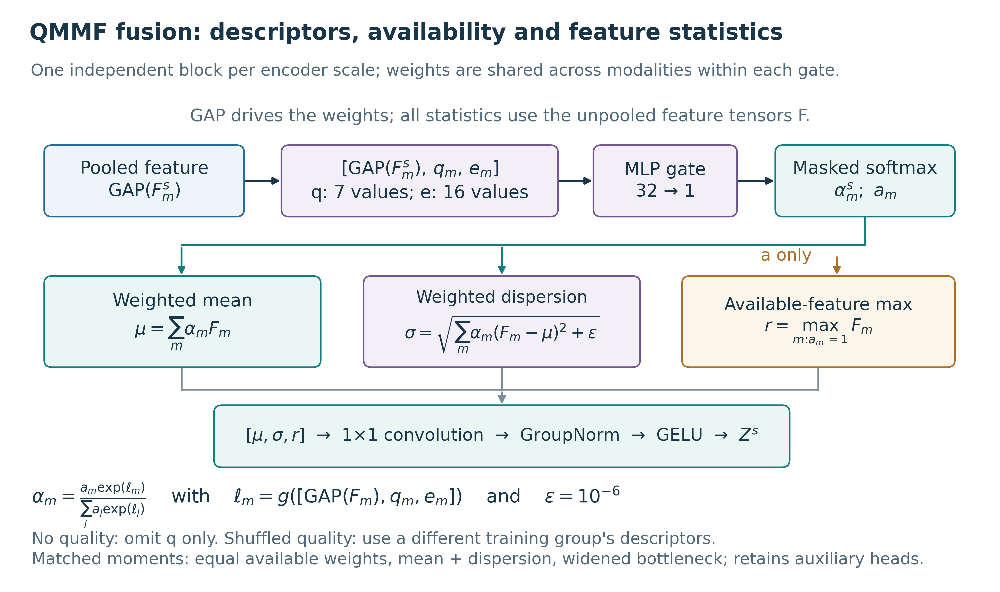

# QMMF architecture: implementation, equations and figure guide

This report describes the model that produced the completed Kaggle results. The architecture was checked against the frozen main-study source and the resolved configurations for seeds 42, 43 and 44. The drawing is an original explanatory artifact added with release v1.2.0; it is not a new experiment or an additional Kaggle result figure.

## Architecture plate and caption


**Figure A. Implemented quality-conditioned masked moment-fusion network.** (A) Five-slice windows from T1, T1ce, T2 and FLAIR pass through a modality-shared encoder. A learned modality embedding conditions the shared stem through FiLM. Per-modality features at four spatial scales are fused independently, and the fused features provide the bottleneck input and three decoder skips. Two residual factorized large-kernel blocks operate at the bottleneck. The decoder produces three overlapping sigmoid outputs for whole tumor (WT), tumor core (TC) and enhancing tumor (ET). Native-volume reconstruction and nested-region projection precede fixed-threshold masks. (B) A gate uses pooled features, seven quality proxies and modality identity to weight available inputs. Fusion concatenates weighted mean, weighted dispersion and available-feature maximum. (C) Training includes an EMA teacher with complete-modality inputs, confidence-masked subset consistency and two auxiliary supervision heads. Dashed paths are training-only. Shapes describe 192×192 training crops; inference retains the full brain field of view. Anatomical icons and colored regions are schematic, not measured MRI images or model predictions.

[Editable SVG](figures/qmmf_architecture.svg) · [Vector PDF](figures/qmmf_architecture.pdf) · [400-dpi PNG](figures/qmmf_architecture.png) · [combined two-page plate](figures/architecture_plate.pdf) · [source/shape manifest](figures/architecture_manifest.json).

## Tensor flow and exact implementation

The model receives images shaped `[B, 4, 5, H, W]`, availability `[B, 4]` and quality `[B, 4, 7]`. At least one modality must be available. `B` is batch size; `H=W=192` for the recorded training crop. The stem and subsequent encoders share weights across modalities, implemented by flattening batch and modality axes. Encoded modality features remain separate until fusion; a fused feature is not fed into the next per-modality encoder stage.

| Stage | Implementation | Output for one 192×192 sample |
|---|---|---|
| Identity | Four learned embeddings of length 16; stem FiLM | One embedding per sequence |
| Shared stem | Conv3D kernel 5×3×3 collapses slice depth; GroupNorm/GELU; FiLM; 3×3 refinement | `[4, 24, 192, 192]` |
| Encoder 2 | Average pool 2×2; two Conv2D 3×3 / GroupNorm / GELU blocks | `[4, 48, 96, 96]` |
| Encoder 3 | Same pattern, wider channels | `[4, 96, 48, 48]` |
| Encoder 4 | Same pattern, wider channels | `[4, 160, 24, 24]` |
| Fusion at each scale | Quality/identity gate; available mean, dispersion and max; 1×1 projection | `[1, C, Hs, Ws]` at each scale |
| Context | Two residual blocks: depthwise 1×7 then 7×1; normalization; pointwise MLP | `[1, 160, 24, 24]` |
| Decoder 3 | Bilinear upsampling; 1×1 channel reduction; fused skip concatenation; two 3×3 blocks | `[1, 96, 48, 48]` |
| Decoder 2 | Same pattern | `[1, 48, 96, 96]` |
| Decoder 1 | Same pattern | `[1, 24, 192, 192]` |
| Output | 1×1 convolution, then sigmoid outside the model forward method | `[1, 3, 192, 192]` |
| Training auxiliaries | 1×1 heads on the first two decoder outputs | `[1, 3, 48, 48]` and `[1, 3, 96, 96]` |

The actual parameter count is **1,221,465**, including the training auxiliary heads. A synthetic CPU forward pass checks these tensors using the submitted model configuration; evaluation mode returns no auxiliary logits. The [manifest](figures/architecture_manifest.json) records every hook output, configuration hash, renderer hash and exported-file hash. It records no new performance result.

The context block is convolutional, with no attention mechanism. Its depthwise 1×7 and 7×1 convolutions are followed by GroupNorm and a pointwise MLP with expansion two. A learned LayerScale starts at 0.01 on the residual branch. Decoder upsampling is bilinear, followed by a 1×1 reduction and skip concatenation; it is not a transposed convolution.

## Quality descriptors and fusion equations



**Figure B. Fusion details and component controls.** Pooled features determine one scalar gate weight per modality and scale. The three feature statistics act on the unpooled feature tensors. The maximum uses the availability mask and does not use learned quality weights. The square-root variance branch uses epsilon 10^-6. The no-quality control omits the quality descriptor from the gate; the shuffled-quality control uses descriptors donated by a different training group. The capacity-matched control uses equal available weights, mean plus dispersion and widths 24/48/96/168, retaining the QMMF encoder-decoder family and its auxiliary heads.

[Editable fusion SVG](figures/qmmf_fusion_detail.svg) · [fusion vector PDF](figures/qmmf_fusion_detail.pdf) · [fusion PNG](figures/qmmf_fusion_detail.png).

For scale `s` and modality `m`, let `F_m` be the feature map, `q_m` the seven-value quality descriptor, `e_m` the 16-value embedding and `a_m` the availability indicator. Scale superscripts are suppressed in the following equations:

```text
ell_m = MLP_s(concat(GAP(F_m), q_m, e_m))
alpha_m = a_m * exp(ell_m) / sum_j(a_j * exp(ell_j))
mu = sum_m(alpha_m * F_m)
sigma = sqrt(sum_m(alpha_m * (F_m - mu)^2) + 1e-6)
r = max(F_m over m with a_m = 1)
Z = GELU(GroupNorm(Conv1x1(concat(mu, sigma, r))))
```

The gate has a 32-unit hidden layer, GELU and a scalar output without final bias. The implementation masks logits, zeroes absent weights and renormalizes over available modalities; it performs feature-moment reductions in float32. The variance quantity is square-rooted before fusion, so “dispersion” in the figure corresponds to the registry's “variance” branch. These are feature statistics, not predictive uncertainty estimates or clinical reliability measurements.

| Quality proxy | Implemented measurement |
|---|---|
| `snr_proxy` | Foreground median absolute deviation divided by background median absolute deviation, with a numerical floor |
| `coefficient_variation` | Foreground standard deviation divided by the absolute mean plus epsilon |
| `entropy` | Normalized entropy of a clipped 64-bin intensity histogram |
| `robust_dynamic_range` | Foreground 95th–5th percentile range divided by median absolute deviation |
| `zero_support_fraction` | Near-zero fraction within the chosen brain support |
| `high_frequency_energy` | Mean gradient magnitude divided by median absolute deviation |
| `center_of_mass_shift` | Positive-intensity centroid displacement from the support centroid, normalized by volume extent |

Proxies are computed on the complete, **preprocessed** volumes and cached before training-window augmentation. Training uses within-group descriptor medians, then fits per-modality medians and interquartile ranges across training groups; transformed values are clipped to ±5. These proxies are not validated acquisition-quality scores. In particular, background floors, nonzero support and normalized intensities can affect their interpretation. No raw-acquisition quality or quality-estimation accuracy was evaluated.

The shuffled-quality intervention is a fixed donor mapping between different training groups, with a donor case chosen within the donor group. It is not an epoch-wise within-batch permutation. Inference uses the evaluated case's descriptors; the negative control tests the training relationship. The no-quality network omits `q` from the descriptor entirely while retaining pooled-feature and identity gating; it is not an equal-weight fusion model.

## Training and inference paths

The student receives a nonempty sampled modality subset. The teacher receives the corresponding augmented complete-modality window and all-one availability. Teacher weights follow the student through an EMA, with decay scheduled from 0.99 to 0.999. Gradients do not flow through teacher predictions. Consistency activates at zero-based epoch 18 of the 120-epoch run, matching the 15% warmup fraction.

The recorded objective is:

```text
Lseg = 0.6 * soft_Dice_loss + 0.4 * BCE
L = Lseg + 0.10 * Lboundary + 0.05 * Lnesting
         + 0.20 * Lconsistency + Laux
Laux = 0.50 * Lseg(head_48x48) + 0.25 * Lseg(head_96x96)
Lconsistency = mean((sigmoid(student) - sigmoid(teacher))^2
                    over teacher confidence >= 0.90)
```

The teacher confidence is `max(p, 1-p)` for each output voxel/region. Confidence masking does not establish that teacher predictions are correct. Calibration loss has coefficient zero in the completed matrix. Removing consistency sets its coefficient to zero and omits the EMA teacher. All other coefficients above remain unchanged in that control.

At inference, each window predicts its central slice. Ordered slice predictions are restored to the cropped brain grid, nested probabilities are projected (`TC=min(TC,WT)`, `ET=min(ET,TC)`), and the crop is restored to native-volume geometry. Masks use the fixed threshold 0.5. The teacher and auxiliary heads are not used for the reported predictions. The evaluated checkpoint is the selected student checkpoint, not the EMA teacher. Inputs were masked after complete four-modality preprocessing, including support/crop construction; this evaluation does not simulate never acquiring a sequence from the beginning of the processing pipeline.

## Ablation interpretation and measured scope

The complete [README ablation table](../README.md#ablation-studies) and [paired CSV](../results/segmentation_main/paired_repeated_seed_deltas.csv) contain all nine executed variants. QMMF and its six same-family controls expose two auxiliary heads. The local HeMIS-style and U-Net baselines expose none, so their comparisons change both architecture and effective objective. The [effective-objective audit](../results/implementation_audit/effective_objectives.csv) documents this difference.

No quality has 1,220,569 parameters (896 fewer than QMMF). The widened moment-fusion control has 1,227,977 parameters (approximately 0.53% more). This control is close in capacity, not mathematically identical in parameter count. It also replaces learned gating and drops the maximum branch; it cannot isolate one of those changes by itself.

The architecture is the implementation of a research hypothesis. The completed reserved evaluation favors no quality on full, mean-subset and worst-subset Dice under the declared adjusted comparisons. Neither the drawing nor the combination of known components establishes architectural novelty. The stronger contribution is the controlled empirical test and its auditable negative finding. The broader registry includes unexecuted context, FiLM and depth ablations; their existence in code is not evidence of experimental completion.

## Visual references, originality and editing

The plates use an original medical-style composition with a restrained palette, explicit dimensions, directional edges and a module detail panel. The visual references reviewed were:

| Reference | Design convention used | Difference from the implemented network |
|---|---|---|
| [U-Net, Figure 1](https://arxiv.org/pdf/1505.04597) | Explicit resolution/channel labels and visible encoder-decoder skip paths | This implementation uses shared modality encoding, moment fusion, padded convolutions and bilinear upsampling |
| [HeMIS, Figure 1](https://arxiv.org/pdf/1607.05194) | Separate modality features and statistical aggregation | QMMF uses shared encoder weights, quality-conditioned gates, a maximum branch and four fusion scales |
| [Sebastian Raschka, The Big LLM Architecture Comparison](https://magazine.sebastianraschka.com/p/the-big-llm-architecture-comparison) | Consistent module colors and enlarged component annotations | Visual reference only; the MRI implementation has no LLM, token or attention modules |

No artwork from these sources was copied or embedded. No author endorsement is implied. The schematic anatomy is original vector geometry, so no patient image or result montage is used in the architecture plates. Actual predictions remain in Kaggle result Figure 19 with their existing attribution.

The SVG exports retain editable text and vector paths. PDFs retain vector lines/text and use embedded TrueType fonts; PNGs are exported at 400 dpi. The main plate's native page is 9×6.85 inches. When reducing to a venue's column width, review label sizes; use the enlarged fusion plate or split panels if needed for the journal's minimum text size. No unspecified venue formatting compliance is claimed.

```bash
python scripts/build_architecture_diagrams.py --output runtime/architecture_rebuild
```

Edit [the renderer](../scripts/build_architecture_diagrams.py), regenerate into a separate directory, review arrows and labels visually, then replace the approved documentation exports. The script checks source identity before drawing; changing a model requires deliberate review of the figure's architecture contract. Reference-paper downloads and credentials are outside the release inventory. Historical experiment sources, result figures and dated receipts retain their original hashes.

## Source map

| Detail | Exact repository source |
|---|---|
| Shared encoder, fusion placement, decoder and heads | [qmmf_net.py](../segmentation/src/qmmf/models/qmmf_net.py) |
| Masked softmax, weighted statistics and fusion projection | [qmmf.py](../segmentation/src/qmmf/models/qmmf.py) |
| FiLM, stem, large-kernel residual blocks and upsampling | [blocks.py](../segmentation/src/qmmf/models/blocks.py) |
| Quality proxies and robust scaler | [quality.py](../segmentation/src/qmmf/quality.py) |
| Masking, descriptor donors and complete teacher windows | [dataset.py](../segmentation/src/qmmf/dataset.py) |
| Training objective and consistency confidence | [losses.py](../segmentation/src/qmmf/losses.py), [trainer.py](../segmentation/src/qmmf/trainer.py) |
| Volume reconstruction and fixed threshold | [inference.py](../segmentation/src/qmmf/inference.py) |
| Actual run settings and immutable submitted code | [resolved protocol](../results/segmentation_study_s42/protocol_lock.json), [source snapshot](../audit/source_snapshots/segmentation_study_s42_v1.json) |
