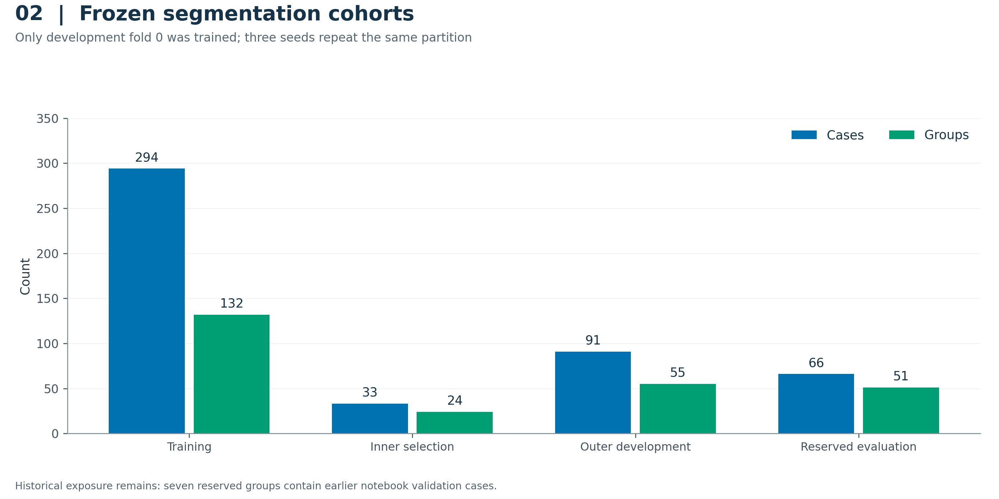
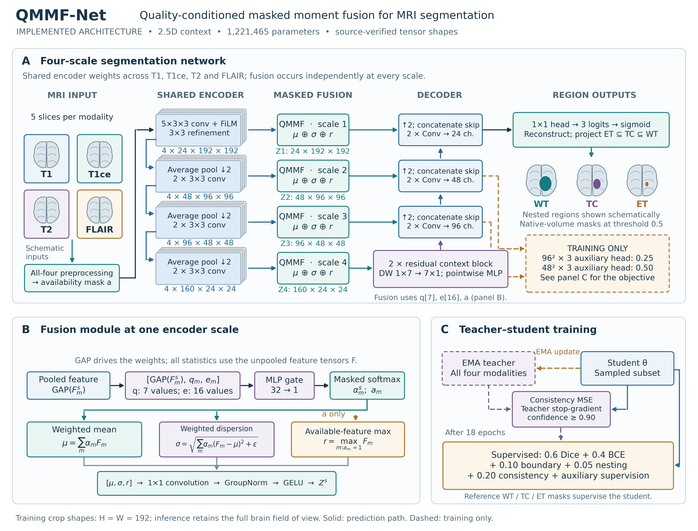
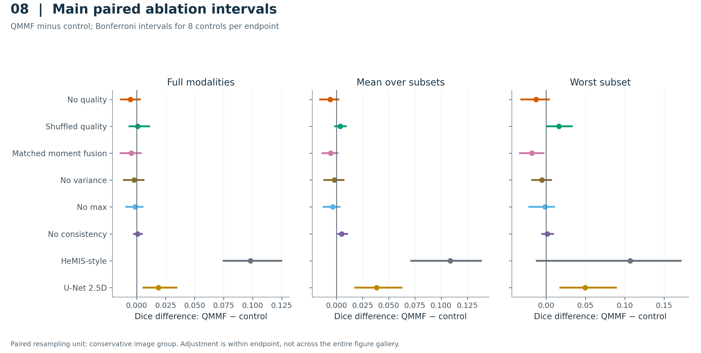
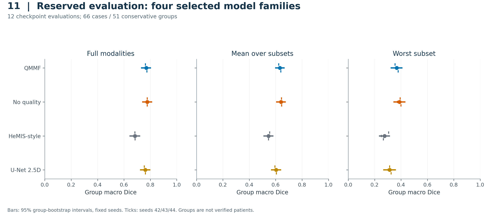
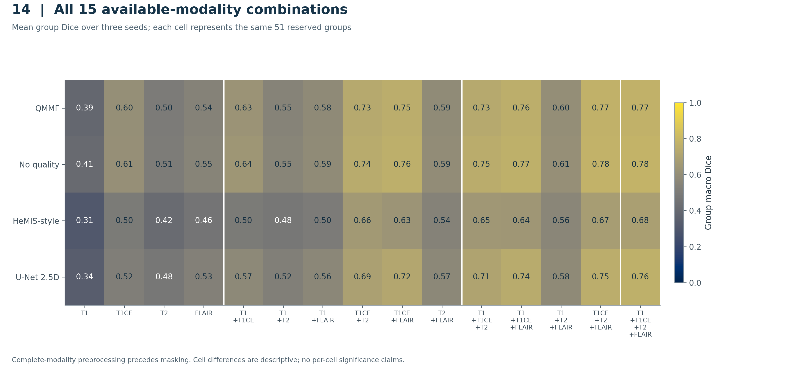
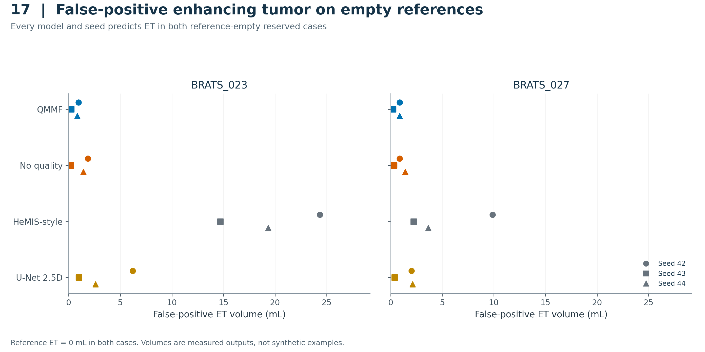
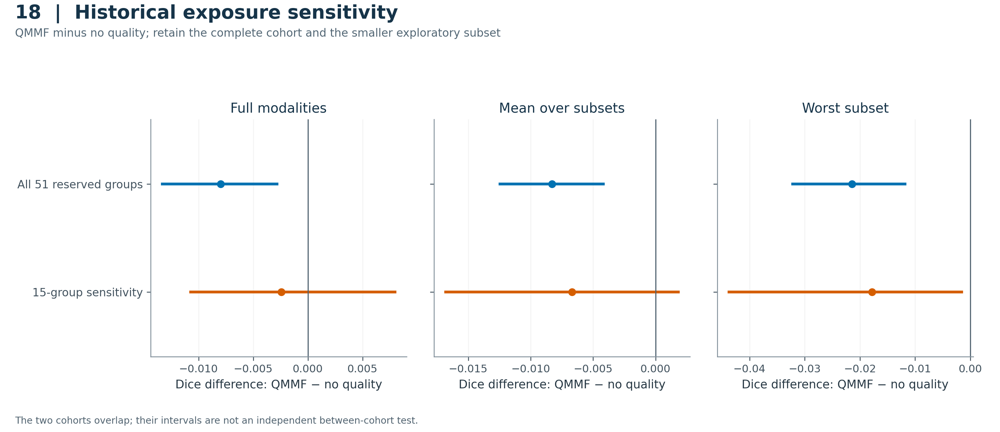

# Evaluating Quality Conditioning for MRI Segmentation with Missing Modalities

Working manuscript draft for author revision. Venue, authorship and institutional declarations are not yet supplied. This document reports completed internal experiments and retains their limitations. Gallery figure numbers refer to the stable repository catalog and can be renumbered for the selected venue.

## Abstract

Quality descriptors may appear useful for fusing incomplete MRI inputs, but their contribution requires controls that preserve the surrounding training system. We evaluated an implemented quality-conditioned moment-fusion model after auditing its preprocessing, inference and data partitions. An audit of 484 canonical segmentation case IDs identified 262 conservative image-similarity groups. Nine variants were trained on one grouped development fold with three fixed seeds, followed by evaluation of four prespecified model families on 66 reserved cases in 51 groups. All 15 nonempty modality subsets were evaluated on one fixed representative per reserved group. QMMF achieved full-modality group macro Dice of 0.7689 +/- 0.0055 across seeds, compared with 0.7769 +/- 0.0007 without quality features. The QMMF-minus-control difference was -0.0080 with an adjusted paired group-bootstrap interval of [-0.0133, -0.0028]; mean- and worst-subset comparisons also favored removing quality. An exploratory 15-group sensitivity addressing historical exposure left the full-modality difference uncertain. These results do not support the implemented quality-conditioning advantage. Unknown patient identities, earlier validation exposure, differences in cross-family objectives and simulated missingness after complete-modality preprocessing limit generalization.

## 1. Introduction

MRI segmentation with incomplete modality availability requires an evaluation that distinguishes the contribution of a proposed component from the surrounding model and training choices. Modality aggregation is established prior work: [HeMIS](https://arxiv.org/abs/1607.05194) learns modality-specific representations that can be combined when inputs are missing. More recent work, including [SimMLM](https://arxiv.org/abs/2507.19264), studies dynamic modality weighting and objectives designed around differing input availability. These precedents motivate a focused empirical question about the additional value of the implemented quality descriptors.

This study evaluates that question within a repaired implementation derived from the supplied research notebook. The work includes a conservative similarity audit, explicit role boundaries, same-family ablations, repeated training seeds and a reserved-cohort evaluation. It reports a negative finding: the quality-conditioned variant did not improve the declared reserved endpoints over its no-quality control. The contribution is the bounded empirical evaluation and its auditable evidence, rather than a claim of architectural novelty or superiority over current published methods.

### 1.1 Research questions and contributions

The completed evidence addresses five questions: (RQ1) do the quality descriptors improve segmentation beyond pooled-feature and modality-identity gating; (RQ2) do learned feature moments improve over simpler fusion at similar capacity; (RQ3) does complete-input EMA consistency improve subset robustness; (RQ4) what failures remain across all modality combinations and empty-reference lesions; and (RQ5) how does the conclusion change when restricting historical exposure? This question wording organizes the completed report retrospectively; the dated experimental plan and frozen protocols define which comparisons were specified before their outcomes.

The study contributes an audited grouped benchmark and corrected implementation, same-family controls across three seeds, a reserved evaluation retaining a negative quality-conditioning result, and complete subset/failure and historical-sensitivity reporting. Its reproducibility package includes exact Kaggle versions, source/configuration hashes, 20 result visualizations with plotted data, and source-verified architecture diagrams. These are empirical and reproducibility contributions. Modality statistics and dynamic gates have substantial prior art, and the tested component combination has not established a first-of-its-kind or state-of-the-art claim.

## 2. Data, provenance and cohort construction

The segmentation source is the Brain Tumour task mirrored from the [Medical Segmentation Decathlon](https://www.nature.com/articles/s41467-022-30695-9). Source and mirror information, label mapping and terms are documented in [the dataset report](DATASETS.md). Auditing identified rescaled image copies that crossed the original case-ID partitions. Repaired partitions contain 484 canonical case IDs in 262 conservative similarity groups. Group identities describe observed image similarity; patient identities are not independently established.

The executed main study uses development fold 0 with 294 training cases in 132 groups, 33 inner-selection cases in 24 groups, and 91 outer-development cases in 55 groups. A reserved set contains 66 cases in 51 groups. Three seeds repeat this fixed partition. Although four-fold split metadata is retained, the completed main results are not four-fold cross-validation.

<!-- BEGIN TABLE:segmentation_cohorts -->
| Role | Cases | Groups |
| --- | --- | --- |
| train | 294 | 132 |
| inner_val | 33 | 24 |
| outer_val | 91 | 55 |
| reserved | 66 | 51 |

Only fold 0 was executed in the main study. The 15-group historical sensitivity is a nested subset of the reserved cohort.
<!-- END TABLE:segmentation_cohorts -->

A retrospective provenance audit identified seven reserved groups containing cases from the original notebook's recorded validation subset. The word reserved therefore refers to the revised fitting and selection boundary, not a historically untouched dataset. A separate sensitivity includes 15 groups/18 cases entirely outside the original development partition. Its rule was frozen before reserved outcomes but after some main development outcomes were available; it is exploratory and does not replace the full report.

## 3. Models and implementation controls

The QMMF implementation uses available-modality feature aggregation with quality-conditioned components. The study repairs verified channel order, inference geometry and normalization, training-fitted quality scaling, complete-modality teacher inputs and the shuffled-quality control. Exact implementation details are preserved in the submitted source snapshots and resolved configurations rather than inferred from the names of the original notebook variants.

**Architecture plate A.** A shared five-slice stem uses a 5×3×3 convolution and modality-identity FiLM, followed by a four-scale encoder with widths 24/48/96/160. Independent fusion blocks combine available modality features at each scale; fused features feed the decoder skips and a bottleneck with two factorized large-kernel residual blocks. Bilinear decoder stages predict overlapping WT/TC/ET outputs. The fusion detail separates weighted mean/dispersion from the availability-only maximum. Training uses an EMA complete-input teacher and two auxiliary heads; these are absent from the prediction path. Anatomical symbols are schematic, and displayed spatial sizes describe the training crop. [Full equations, implementation map and publication exports](ARCHITECTURE.md).

At each scale, an MLP with a 32-unit hidden layer forms one modality logit from globally pooled features, seven quality proxies and a 16-value learned modality embedding. Masked softmax normalizes weights over available sequences. Fusion concatenates weighted mean, square-root weighted variance (epsilon 10^-6) and available-feature maximum, followed by 1×1 convolution, GroupNorm and GELU. The maximum is not quality weighted. Proxies are computed on preprocessed volumes before augmentation; their robust scaler is fitted across training groups using within-group medians. The no-quality control omits the descriptor from the gate, while the shuffled control assigns descriptors from different training groups during fitting.

Training combines 0.6 soft Dice and 0.4 BCE, plus boundary (0.10), nesting (0.05), consistency (0.20) and auxiliary losses. Auxiliary segmentation weights are 0.50 at 48×48 and 0.25 at 96×96. The EMA teacher receives the corresponding complete-input window; consistency activates at epoch 18/120 and uses squared probability error where teacher confidence is at least 0.90. Evaluation uses the selected student checkpoint, reconstructs native-volume probabilities, enforces ET subset TC subset WT and thresholds at 0.5. Quality proxies and gate weights are not validated clinical quality or uncertainty estimates.

The main matrix comprises QMMF, no quality, shuffled quality, matched moment fusion, no variance, no max, no consistency, a HeMIS-style 2.5D model and a U-Net 2.5D model. The last two are local comparator implementations; the U-Net naming acknowledges the encoder-decoder family introduced by [Ronneberger and colleagues](https://arxiv.org/abs/1505.04597). They must not be represented as exact modern benchmark reproductions. QMMF and its same-family controls use two auxiliary supervision heads with weights 0.5 and 0.25; the HeMIS-style and U-Net implementations do not. Cross-family differences consequently combine architecture and effective objective changes.

All 27 main fits use five-slice 2.5D context and 192-by-192 in-plane crops, seeds 42, 43 and 44, and a budget of 120 epochs with 100 microbatches per epoch. Resolved configurations use AdamW with learning rate 0.0003, weight decay 0.001, batch size four and accumulation two. This gives 6,000 scheduled optimizer-step opportunities per fit. Inner validation occurs every ten epochs. Checkpoints are selected by the declared inner-selection score, without using reserved outcomes. Full resolved settings, effective-objective checks and training histories remain in the repository.

## 4. Evaluation and uncertainty

WT, TC and ET Dice are evaluated with the frozen nonempty-reference rule. The headline full-modality score first forms each case's regional macro, averages cases within conservative groups, then weights groups equally. Repeated-seed tables summarize the three fixed seed estimates with their mean and sample standard deviation. Regional tables have their own nonempty-reference denominators; averaging regional means would not reconstruct the case-first headline metric.

Missing-modality evaluation masks channels after complete four-channel preprocessing, including support/crop construction. All 15 nonempty subsets are retained. Development subset evaluation uses 16 fixed group representatives; reserved subset evaluation uses 51 representatives. Mean-subset Dice averages each representative's subset scores before averaging groups. Worst-subset Dice takes each representative's minimum before averaging groups. The all-four-subset result uses one representative per group and is not identical to the headline full-modality score using all 66 reserved cases.

Paired uncertainty uses 10,000 bootstrap draws of conservative image groups, retaining all three fixed seeds within each draw. Seed SD is reported separately. Main ablation intervals adjust for eight QMMF-control contrasts separately per endpoint; reserved intervals adjust for three controls separately per endpoint. The adjustment is not a global guarantee across all endpoints and exploratory analyses. Neither slices nor repeated seed/group records are treated as independent patients.

## 5. Results

### 5.1 Main development ablations

All nine variants completed all three scheduled fits. QMMF achieved full-modality outer group Dice of 0.8052 +/- 0.0028, compared with 0.8106 +/- 0.0042 for no quality. The adjusted same-family no-quality comparisons did not establish a QMMF advantage. The matched moment-fusion control had a better mean worst-subset result under the declared paired adjustment. Every variant remains in the comparison, including controls with higher scores.

The adjusted main contrasts for no quality, no variance and no max all included zero. QMMF exceeded shuffled quality on worst-subset Dice by 0.0161 with adjusted interval [0.0009, 0.0326]; their full and mean-subset contrasts were uncertain. This supports a worse outcome with mismatched training descriptors, without demonstrating benefit over descriptor omission. QMMF-minus-matched-moment worst-subset Dice was -0.0184 with adjusted interval [-0.0335, -0.0035]. Removing consistency reduced mean-subset Dice by 0.0050, with QMMF-minus-control adjusted interval [0.0015, 0.0102]; its full and worst-subset comparisons were uncertain. The capacity-matched moment model has 1,227,977 parameters, approximately 0.53% above QMMF's 1,221,465, and retains the same-family auxiliary objective. These results answer component questions without turning uncertain contrasts into equivalence claims.

<!-- BEGIN TABLE:main_segmentation -->
| Model | Full Dice | Mean-subset Dice | Worst-subset Dice |
| --- | --- | --- | --- |
| QMMF | 0.8052 +/- 0.0028 | 0.6492 +/- 0.0059 | 0.3407 +/- 0.0184 |
| No quality | 0.8106 +/- 0.0042 | 0.6551 +/- 0.0081 | 0.3537 +/- 0.0197 |
| Shuffled quality | 0.8044 +/- 0.0008 | 0.6455 +/- 0.0060 | 0.3246 +/- 0.0323 |
| Matched moment fusion | 0.8098 +/- 0.0032 | 0.6548 +/- 0.0023 | 0.3591 +/- 0.0107 |
| No variance | 0.8073 +/- 0.0011 | 0.6512 +/- 0.0068 | 0.3462 +/- 0.0042 |
| No max | 0.8066 +/- 0.0032 | 0.6528 +/- 0.0077 | 0.3423 +/- 0.0135 |
| No consistency | 0.8043 +/- 0.0038 | 0.6441 +/- 0.0052 | 0.3394 +/- 0.0082 |
| HeMIS-style | 0.7072 +/- 0.0060 | 0.5403 +/- 0.0039 | 0.2338 +/- 0.0249 |
| U-Net 2.5D | 0.7865 +/- 0.0105 | 0.6107 +/- 0.0093 | 0.2912 +/- 0.0196 |

Entries are means +/- sample SD over three fixed training seeds. Group-bootstrap intervals and cohort denominators are in the source CSV and results report.
<!-- END TABLE:main_segmentation -->

### 5.2 Reserved evaluation

The four prespecified families were evaluated using their three selected checkpoints, producing 12 completed reserved evaluations. The cohort includes all 66 reserved cases and 51 groups. QMMF full-modality Dice was 0.7689 +/- 0.0055; no quality achieved 0.7769 +/- 0.0007. Their difference was -0.0080 with adjusted interval [-0.0133, -0.0028]. QMMF-minus-no-quality differences for mean-subset and worst-subset Dice were -0.0083 and -0.0214, respectively, with both adjusted intervals below zero. These observations support a negative finding for the implemented quality descriptors under the recorded training protocol.

<!-- BEGIN TABLE:reserved_segmentation -->
| Model | Full Dice | Mean-subset Dice | Worst-subset Dice |
| --- | --- | --- | --- |
| QMMF | 0.7689 +/- 0.0055 | 0.6322 +/- 0.0080 | 0.3672 +/- 0.0120 |
| No quality | 0.7769 +/- 0.0007 | 0.6405 +/- 0.0075 | 0.3886 +/- 0.0137 |
| HeMIS-style | 0.6837 +/- 0.0007 | 0.5462 +/- 0.0080 | 0.2748 +/- 0.0286 |
| U-Net 2.5D | 0.7621 +/- 0.0074 | 0.6034 +/- 0.0078 | 0.3140 +/- 0.0115 |

Entries are means +/- sample SD over three fixed training seeds. Group-bootstrap intervals and cohort denominators are in the source CSV and results report.
<!-- END TABLE:reserved_segmentation -->

<!-- BEGIN TABLE:reserved_contrasts -->
| Control | Endpoint | QMMF - control | Adjusted interval |
| --- | --- | --- | --- |
| No quality | Full | -0.0080 | [-0.0133, -0.0028] |
| No quality | Mean subset | -0.0083 | [-0.0124, -0.0042] |
| No quality | Worst subset | -0.0214 | [-0.0322, -0.0119] |
| HeMIS-style | Full | +0.0853 | [+0.0712, +0.0993] |
| HeMIS-style | Mean subset | +0.0861 | [+0.0734, +0.1003] |
| HeMIS-style | Worst subset | +0.0923 | [+0.0617, +0.1258] |
| U-Net 2.5D | Full | +0.0068 | [-0.0045, +0.0189] |
| U-Net 2.5D | Mean subset | +0.0289 | [+0.0210, +0.0375] |
| U-Net 2.5D | Worst subset | +0.0532 | [+0.0355, +0.0738] |

10,000 paired group-bootstrap draws retain all three training seeds. Bonferroni adjustment uses three controls separately per endpoint; negative values favor the control.
<!-- END TABLE:reserved_contrasts -->

QMMF exceeded the HeMIS-style comparator on all three reserved endpoints under the declared adjustment. Its full-modality comparison with U-Net was uncertain, while mean- and worst-subset comparisons favored QMMF. These cross-family findings cannot isolate the quality module because the models and auxiliary objectives differ. The reserved comparison set was not expanded after development outcomes to include whichever variant ranked first.

### 5.3 Missing modalities and failure analysis

The no-quality control had the higher descriptive three-seed mean in all 15 modality combinations. These cell-wise comparisons are not additional adjusted hypothesis tests. QMMF obtained approximately 0.3921 with T1 alone, while its average case-specific worst-subset score was 0.3672. A worst-subset mean can be below every column mean because different cases have different worst combinations.

The frozen rule excludes empty-reference regions from primary Dice. Both ET-empty reserved cases, BRATS_023 and BRATS_027, nevertheless received false-positive ET predictions from every model and seed. Their 24 measured predicted volumes are retained in Figure 17. Nonempty-reference ET averages must be read together with this failure mode. The prespecified qualitative montage retains all four models on BRATS_143, BRATS_119 and BRATS_023 at seed 42; displayed scores are whole-volume scores. BRATS_143 has recorded historical validation exposure.

### 5.4 Historical sensitivity and computation

The exploratory 15-group sensitivity retained all four model families and all three seeds. QMMF-minus-no-quality adjusted intervals crossed zero for full-modality and mean-subset Dice. The worst-subset difference was -0.0178 with adjusted interval [-0.0437, -0.0016], still favoring no quality. Because these groups are a subset of the complete reserved cohort, the sensitivity is not an independent replication.

Lossless cache changes measured approximately 4.02-fold QMMF and 3.51-fold HeMIS-style training-segment throughput improvements on Kaggle. These bounded measurements used 10 warmup and 100 timed microbatches per model/format. They do not estimate end-to-end experiment speedup or repeated-run timing uncertainty. All main fits reached the epoch budget; the learning trajectories do not establish universal convergence.

## 6. Discussion and limitations

The closest controls provide the clearest interpretation: quality conditioning did not improve the recorded reserved endpoints over an otherwise comparable no-quality configuration. The result applies to this descriptor implementation, data partition and optimization schedule. It does not establish that every possible quality-aware fusion method is inferior. Architectural differences from more distant baselines should not obscure the same-family negative finding.

Several factors bound the evidence. Conservative similarity groups are not verified patients, and the data audit cannot prove removal of all patient overlap. Historical validation exposure prevents describing the revised reserved set as historically untouched. The main training study covers one development fold and three fixed seeds, not several independent cohorts. Cross-family objectives differ. Missingness is simulated after complete-modality preprocessing, and the subset evaluation uses one representative per group. No independent external clinical cohort or contemporary author-implementation comparator has been evaluated here. The smaller historical sensitivity is exploratory and has limited sample size.

The practical value of the release is its traceability: complete rather than favorable-only model tables, preserved failure provenance, fixed qualitative examples, source hashes and a separately executed 20-figure Kaggle report. The accompanying classification experiment is a separate image-level benchmark and should be described in supplementary material or a different manuscript. Its results should not be combined with segmentation into a headline accuracy measure.

## 7. Conclusion

An audited repeated-seed evaluation did not support the implemented quality-conditioning advantage for MRI segmentation under simulated missing modalities. The complete reserved comparisons favored removing quality features, while the smaller historical sensitivity retained uncertainty on some endpoints. The evidence supports a bounded negative-result report and an auditable reproduction package; broader generalization and novelty claims require additional evidence.

## Reproducibility and author declarations

The public GitHub repository contains the two research notebooks, the supporting visualization notebook, executed figure outputs, plotted-data CSVs, result tables and exact Kaggle version/source records. Full data and checkpoints remain accessible through their documented Kaggle sources. The original v1.0.0 experiment release is preserved, and the writing package is a subsequent version. Figure 19 and its source montage retain [the required attribution](../results/conference_figures/ATTRIBUTION.md).

Authors must supply their identities, affiliations, contributions, funding/conflicts, source-code licensing decision and institutional determination for secondary-data use. No ethics approval, consent status, exemption or submission acceptance is inferred from the supplied notebooks. The [writing guide](WRITING_GUIDE.md) lists the remaining author decisions. These are draft declarations, not completed submission statements.
