# Execution record and results

Classification (105 fits), the corrected segmentation pilot (three fits), and the complete main segmentation matrix (27 fits) are independently verified from Kaggle artifacts. Segmentation audits exposed copies crossing the initial case-ID splits and documented historical validation overlap; the revised fits use conservative groups and fresh training-only normalization. All three main seeds, all 12 frozen reserved-cohort checkpoint evaluations and the historical-exposure sensitivity are complete. The reserved results favor removing quality conditioning; every planned model, seed, endpoint and fixed qualitative example is retained.

## Completed classification experiment

Run: [MRI Classification Ablation v2](https://www.kaggle.com/code/dasshovon/mri-classification-ablation-v2), notebook version **2**. Select version 2 in Kaggle's version history. Kernel ID 133581701 identifies the notebook, not an execution-version ID.

There are **105 completed fits**: seven variants, five frozen similarity-group outer folds, and seeds 42, 43, 44. The output contains 4,788 OOF probability rows, with 228 unique images for each model/seed. Independent checks confirmed one prediction per image/model/seed, agreement with the frozen outer test assignments, valid probabilities and reproducibility of the mean macro F1 values from the prediction CSV.

All models use the same 209 image-similarity groups and nested validation partitions. Mean and standard deviation below are over three seed-specific pooled OOF metrics, not fifteen independent test cohorts.

| Variant | Macro F1 mean +/- seed SD | Accuracy | AUROC |
|---|---|---|---|
| Full MSCANet-style model | **0.7745 +/- 0.0237** | **0.7807** | 0.8457 |
| Narrow GroupNorm ResNet | 0.7419 +/- 0.0346 | 0.7515 | 0.8040 |
| No attention, no multiscale | 0.7392 +/- 0.0082 | 0.7485 | 0.8268 |
| No multiscale | 0.7374 +/- 0.0233 | 0.7471 | 0.8265 |
| No attention | 0.7346 +/- 0.0096 | 0.7412 | 0.8457 |
| Plain CNN | 0.7120 +/- 0.0562 | 0.7193 | 0.8226 |
| No augmentation | 0.6924 +/- 0.0490 | 0.7091 | 0.7466 |

The full model's descriptive 95% group-bootstrap macro F1 interval is **[0.7235, 0.8159]**. Its mean image-level sensitivity is 0.7636, specificity 0.8084, balanced accuracy 0.7860, average precision 0.8977, Brier score 0.1680 and log loss 0.5431. These are not patient-level diagnostic estimates.

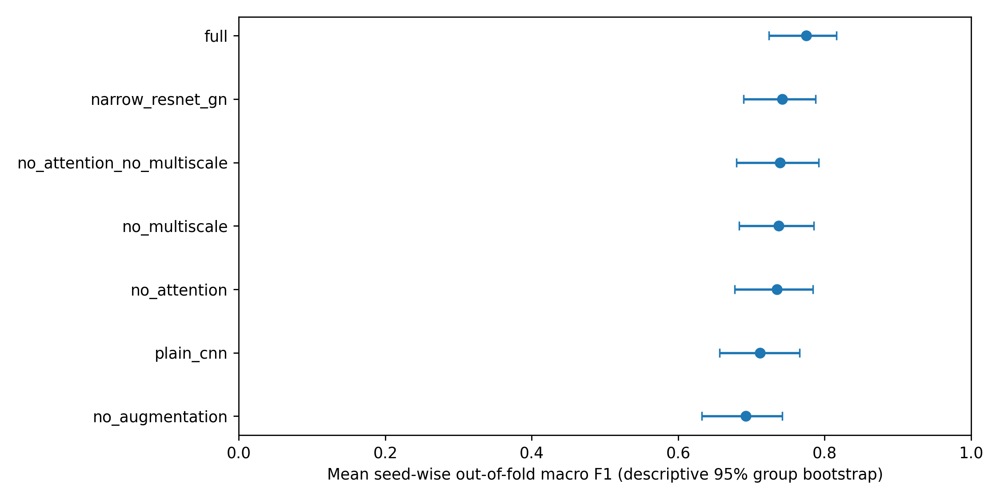

### Paired component comparisons

Differences are full-model macro F1 minus the named control. Intervals resample 209 similarity groups identically for both models and average seed-wise metrics inside each draw. They are descriptive, not multiplicity-corrected confirmatory tests.

| Comparison | F1 difference | Descriptive 95% interval |
|---|---|---|
| Full minus no attention | +0.0399 | [+0.0062, +0.0738] |
| Full minus no multiscale | +0.0372 | [+0.0044, +0.0695] |
| Full minus no augmentation | +0.0821 | [+0.0428, +0.1241] |
| Full minus plain CNN | +0.0626 | [+0.0163, +0.1062] |
| Full minus narrow ResNet | +0.0326 | [-0.0120, +0.0767] |
| Full minus neither component | +0.0353 | [-0.0039, +0.0766] |

The point estimates favor the full model on macro F1. The ResNet and joint-removal comparisons remain uncertain. Removing attention leaves mean AUROC unchanged to the reported precision; these results do not support improvement in every discrimination metric.

An exploratory factorial follow-up gives an attention-by-multiscale interaction of +0.0417 F1, interval [+0.0025, +0.0788]. Attention without multiscale differs by -0.0018, interval [-0.0375, +0.0351]; multiscale without attention differs by -0.0046, interval [-0.0317, +0.0216]. This suggests an interaction in this benchmark, subject to dependent CV fits and unknown patients. It is not a new confirmatory hypothesis test.

### Errors and execution cost

For the full model, 141 images were correctly classified under all three seeds, 43 under two seeds, 25 under one seed, and 19 under none. The per-image error-consistency CSV includes every image and supports failure review without selecting only successful cases.

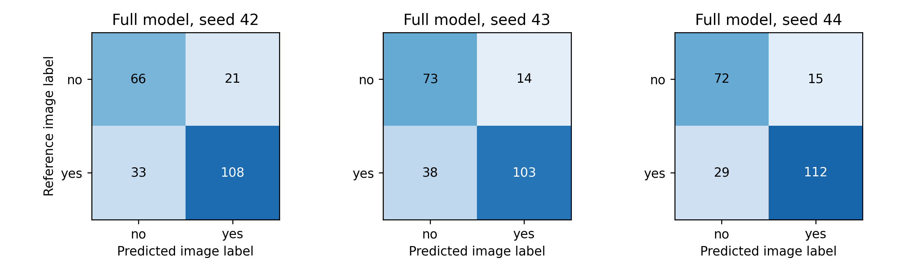

Execution used Python 3.12.13, PyTorch 2.10.0+cu128, NumPy 2.0.2 and pandas 2.3.3 on Tesla T4. Per-fit wall times sum to 405.30 seconds; the retrieved Kaggle log ends at approximately 452.82 seconds. Median epochs run: 35; median selected epoch: 23. These small-image timings do not predict volume-segmentation cost.

| Variant | Trainable parameters | Median fit seconds |
|---|---|---|
| Full | 338,170 | 4.62 |
| No attention | 328,306 | 3.91 |
| No multiscale | 338,170 | 4.63 |
| Neither component | 328,306 | 3.41 |
| No augmentation | 338,170 | 3.97 |
| Plain CNN | 261,874 | 3.34 |
| Narrow GroupNorm ResNet | 700,786 | 2.61 |

These are complete-fit wall times over 15 fits per model, including different early-stopping lengths. They are not standardized inference-latency measurements. The full/no-multiscale contrast preserves parameter count. The narrow ResNet has more parameters but shorter fits in this setup; parameter count alone does not establish speed.

Source SHA-256: `77cc130fba112f2737a5f3645c81c88ce2198a24d3002f8e51ba5284c4b36add`.

Split SHA-256: `008b31e71f5e86fec4d98c728fe7095038810e3eb509d56355f9c7eff86194b3`.

Evidence is under `results/classification/`: completion status, OOF predictions, seed/run metrics, group intervals, paired deltas, factorial follow-up, error-consistency table, figures and `verification.json`. Checkpoints and histories are downloaded separately into the ignored runtime directory.

## Segmentation status and code evidence

The private [CPU preparation job](https://www.kaggle.com/code/dasshovon/mri-segmentation-preparation-v2), version 1, completed the structural audit and all 484 caches in 2,292.17 seconds. Cache size is 4,094,151,697 bytes (3.81 GiB). All volumes have shape 240x240x155x4, RAS orientation and 1 mm isotropic spacing. The manifest hash is `2553ba21125ecb05`.

Independent review then found **six pairs with identical 3D annotation hashes**, including five pairs crossing the initial fold-0 roles. Two cross the nominal locked-test/training boundary. Two sampled pairs (BRATS_001/275 and BRATS_002/293) have identical brain masks, crops and targets, and normalized foreground image correlation above **0.999999 in each of four modalities**. Their raw image arrays differ because intensities were rescaled. The raw-array duplicate gate was insufficient.

The first [segmentation pilot](https://www.kaggle.com/code/dasshovon/mri-segmentation-qmmf-v2), version 1, was cancelled; Kaggle returned `CANCEL_ACKNOWLEDGED` for session 348299981. Available logs contain one training epoch each for QMMF and HeMIS, no checkpoint-selection result and no completed evaluation. These fits will not be resumed or reported as independent performance evidence.

A separate private [CPU similarity audit](https://www.kaggle.com/code/dasshovon/mri-segmentation-similarity-audit), version 2, completed in 62.02 seconds of computation. It compares normalized original-coordinate signatures across all case pairs using float64. There are 610 coarse candidate pairs (395 with zero Hamming distance), 114 strong four-channel/support pairs and no additional strong edges outside that coarse set. Conservative connected components produce **262 image groups**, largest 36. The earlier float32 correlation values exceeded one slightly and are superseded; the group membership is unchanged.

The fresh split hash is **b92f9c7c0fb4c116**. Excluding all 171 groups exposed during cancelled-pilot training leaves 91 groups eligible for the protected test. The frozen test has 51 groups/66 cases; fold 0 has 132 training groups/294 cases, 24 inner groups/33 cases and 55 outer groups/91 cases. The test's restricted eligibility may change its distribution and is not external validation. All related cases stay in the same role. Primary evaluation and paired intervals weight image groups equally; group identity does not establish patient identity. The old hash `a392d0e39514f976` remains failed-protocol provenance. Audits, frozen lists and exposure exclusions are in `results/segmentation_audit/grouped_v2/`.

### Historical use of the reserved cohort

At 2026-09-09 07:03 UTC, an audit of the supplied notebook's source and saved outputs confirmed the original manifest and ordered split hashes. Its recorded pilot used the first 16 fold-0 inner cases for validation. Seven revised reserved groups include seven of those cases, covering nine current cases when all case IDs in those conservative groups are counted. There is no overlap with the original active fold-0 training groups. The original code also prepares or loads normalizers across all four folds; those declared pools cover 387 cases, including 40 current reserved case IDs in 36 reserved groups. Model training in the saved run is limited to fold 0; the other normalization pools must not be described as additional trained model fits.

Protected therefore means reserved from fitting and selection in the revised experiment. Fresh revised weights and training-only normalizers preserve the current split boundary, but the earlier development history prevents a claim that the entire cohort was historically untouched. Amendment 10 and `audit/historical_exposure_sensitivity_protocol.json` freeze an additional exploratory analysis of 15 complete groups/18 cases entirely outside the original development partition, with 15 existing robustness representatives. All four models, three seeds, three endpoints and the same 10,000-draw paired group analysis are retained. This was added after seeds 42 and 43 were reviewed and before revised reserved-cohort outcomes. It supplements the complete 51-group report and does not replace it. The completed sensitivity results are reported below; its small selected cohort and unknown patient identities limit inference.

### Completed corrected pilot

Fresh segmentation pilot version **2** completed with source SHA-256 `23d48096fc8ea9e3ecc0546e979509accf2ca4f60d0eafdb25c3324ae7a017e8`. QMMF, HeMIS-style and no-quality models start from fresh weights and receive the same eight-epoch, 40-microbatch schedule, seed 42. Four fixed inner-group representatives select checkpoints. Full-modality evaluation covers all 91 outer cases/55 groups; all 15 subsets use eight fixed outer-group representatives. These are development results from short training runs.

| Model | Full-modality group Dice | Case-weighted Dice (secondary) | Mean 15-subset Dice, 8 groups | Selected epoch (zero-based) |
|---|---|---|---|---|
| QMMF | 0.2520 | 0.2616 | 0.1660 | 7 |
| HeMIS-style | 0.2461 | 0.2632 | 0.1696 | 3 |
| No quality | 0.2499 | 0.2593 | 0.1766 | 7 |

Full-modality QMMF-minus-HeMIS is **+0.0059**, descriptive 95% paired group interval **[-0.0139, +0.0239]**. QMMF-minus-no-quality is **+0.0021**, interval **[-0.0163, +0.0196]**. The corresponding mean-subset differences are **-0.0036 [-0.0265, +0.0243]** and **-0.0106 [-0.0357, +0.0134]**. Every full/mean-subset/worst-subset comparison includes zero. The pilot provides no established quality-conditioning advantage.

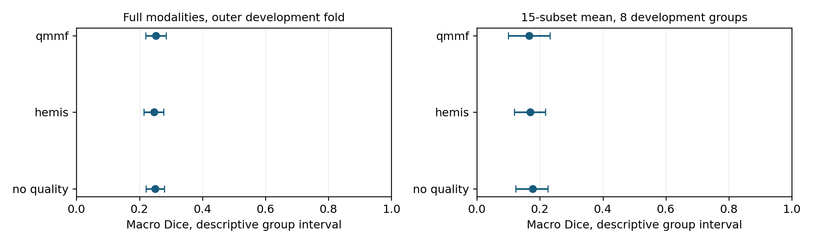

Group-weighted WT/TC/ET Dice is 0.4330/0.3191/0.0012 for QMMF, 0.5795/0.0737/0.0858 for HeMIS-style, and 0.3082/0.3997/0.0390 without quality conditioning. The enhancing-tumor results are poor. ET has a nonempty reference in 89 cases/53 groups; two cases are empty and are reported separately. QMMF predicts no ET in 18 cases. A high whole-tumor value alone would obscure these failures.

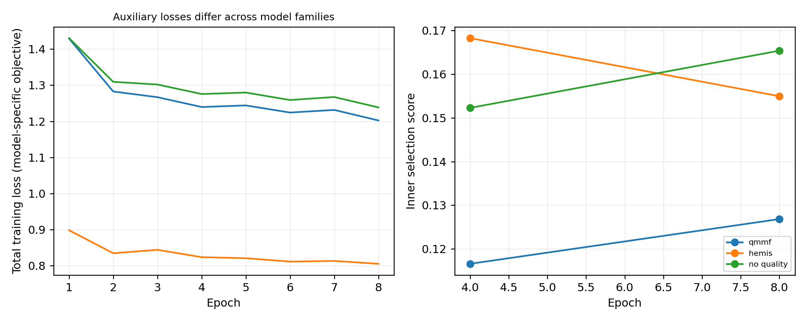

QMMF and no quality include two auxiliary deep-supervision losses, while HeMIS-style has no auxiliary prediction heads. Total training losses across these families therefore have different definitions; their absolute values do not measure a common objective. The same distinction applies to U-Net in the main study. Cross-family scores compare complete model/training setups. Quality-specific attribution instead uses the same-family controls, which retain QMMF's auxiliary heads. The frozen-source architecture audit and pilot-history confirmation are saved in `results/implementation_audit/`, with disclosure timing recorded in Amendment 8.

Recorded fit/validation/evaluation times were 985.50 seconds (QMMF), 874.06 (HeMIS-style) and 927.40 (no quality). These exclude dataset preparation and quality-normalizer fitting before the fit timer starts. Peak allocated GPU memory was 1.35, 0.75 and 1.35 GiB. Parameter counts were 1,221,465, 881,395 and 1,220,569. Each fit reached its eight-epoch budget after two validation checks; QMMF and no quality selected their final checkpoint. The 160 scheduled optimizer-step opportunities are a feasibility schedule, not evidence of convergence. AMP may skip an update with non-finite gradients, so opportunity counts are not measured successful-update counts.

Independent verification recalculated case/regional/group scores, paired group tables, all 15 subsets and Shapley efficiency. It checked group isolation, training-only normalization, quality-donor provenance and checkpoint selection from inner validation. Evidence, histories and figures are in `results/segmentation_grouped_pilot/`; `verification.json` confirms all three planned models completed and the protected test stayed closed.

The worst-subset endpoint first takes each representative case's minimum macro Dice across all 15 subsets, then averages these case-specific minima with equal group weights. Different cases can have different worst subsets. The mean-subset endpoint analogously averages within case first. Inner selection applies these same reductions to its three fixed subsets. These definitions follow the frozen implementation and also apply to the main and protected evaluations.

An expanded history check independently recomputes the 0.6/0.3/0.1 selection composite, checks the exact validation schedule and verifies epoch-budget or patience-based termination. The pilot passes these checks with unchanged scores. `training_diagnostics.csv` reports selected epochs and recent validation changes without automatically declaring convergence; the accompanying provenance records analysis-code hashes and the scope of measured costs. Missing-modality evaluations use channel masking after complete-volume preprocessing, as documented in the dataset card.

### Completed training optimization and main study

The supporting lossless training-cache job completed all 484 cases in 536.45 seconds on Kaggle CPU. It reads back and compares every image/target voxel after conversion. Its inventory hash is `4ad32c8069ddb4d30ed71fc4c6925dc8f66659a91654d052a5702394d85c5921`; cache size is 3,948,265,469 bytes. Independent download checks confirmed source/cache hashes and exact equality of 40 augmented samples from an already exposed case. Local median read-plus-augmentation time for that case was 0.1055 seconds with the original reader and 0.0162 seconds with chunks.

The separate [Kaggle training-throughput benchmark](https://www.kaggle.com/code/dasshovon/mri-segmentation-io-benchmark), version 1, is complete. Each reader receives 10 warmup and 100 timed microbatches, batch four, accumulation two, with active consistency and the actual training augmentation. Reader order is reversed between the two models. Weights are discarded; it uses training groups only and produces no validation/test score.

| Model | Original seconds/microbatch | Chunked seconds/microbatch | Measured ratio |
|---|---|---|---|
| QMMF | 1.0176 | 0.2534 | 4.02× |
| HeMIS-style | 0.9966 | 0.2840 | 3.51× |

These timings include data loading and training for one bounded segment; they are not repeated complete-fit benchmarks. Source SHA-256 is `d672fe042cd21e6b7d94e7d577aee98bed904b90dd8e1e6a1574d49b7fcf553c`. Exactness checks, timings and the resulting budget estimate are in `results/optimization/`.

Amendment 7 freezes **nine variants × seeds 42, 43, 44 = 27 fits**, grouped fold 0, up to **120 epochs × 100 microbatches**. Validation uses 12 fixed inner-group representatives every 10 epochs. Outer full-modality evaluation uses 91 cases/55 groups; robustness uses all 15 subsets on 16 fixed outer-group representatives. The matched-capacity control has 1,227,977 parameters, +0.53% relative to QMMF, with widths aligned to multiples of eight. All main variants receive the same training schedule apart from their declared ablation.

[Seed 42](https://www.kaggle.com/code/dasshovon/mri-segmentation-study-s42), [seed 43](https://www.kaggle.com/code/dasshovon/mri-segmentation-study-s43) and [seed 44](https://www.kaggle.com/code/dasshovon/mri-segmentation-study-s44), all version 1, are complete and independently verified. Source SHA-256 for all three is `037bc0a99fab8f294bc710274b67b96b190ef4c4dbab6303fa64238040ec4d0a`; each execution cell records its own seed. Seed 44 was submitted after seed 42 passed verification. Validation occurs every 10 epochs, so `score nan` in intervening progress lines denotes an epoch without validation, not a reported endpoint.

The measured budget estimate was 7.44 hours per seed on two T4 devices, or 22.33 GPU-session hours for all three seeds. The completed ledgers record **23,831.05, 23,861.05 and 23,966.09 seconds**, respectively: 6.62, 6.63 and 6.66 hours, totaling **19.91 session hours**. Each job allocated two T4 devices and had a 29,000-second runner limit and 30,000-second Kaggle cap. Session elapsed time is distinct from measured GPU busy time. Model workers can overlap; per-fit costs are not isolated inference-speed benchmarks.

### Completed main study: all three seeds

At 2026-09-09 07:44 UTC, **27/27 planned fits passed independent verification**. All nine variants completed 120 epochs for each of seeds 42, 43 and 44: 12 validation checks, 6,000 scheduled optimizer-step opportunities and 48,000 central training windows per fit. Every fit used the frozen source and grouped development fold 0. This is three training repetitions on one development partition, not four-fold cross-validation.

Full-modality evaluation uses 91 cases/55 conservative image groups. Within each case, macro Dice averages only regions with nonempty references; case macros are averaged within group and then groups receive equal weight. Empty-reference outcomes are reported separately below. Mean and worst robustness scores use all 15 modality subsets on the same 16 fixed outer-group representatives, with the case-first reductions defined above.

All entries below are mean +/- sample SD across the three fixed training seeds. Seed SD describes training variation and is distinct from the group-bootstrap uncertainty shown in the figure. Seeds do not increase the number of evaluation groups.

| Model | Full Dice mean +/- seed SD | Mean-subset Dice | Worst-subset Dice |
|---|---|---|---|
| QMMF | 0.8052 +/- 0.0028 | 0.6492 +/- 0.0059 | 0.3407 +/- 0.0184 |
| HeMIS-style | 0.7072 +/- 0.0060 | 0.5403 +/- 0.0039 | 0.2338 +/- 0.0249 |
| U-Net 2.5D | 0.7865 +/- 0.0105 | 0.6107 +/- 0.0093 | 0.2912 +/- 0.0196 |
| No quality | 0.8106 +/- 0.0042 | 0.6551 +/- 0.0081 | 0.3537 +/- 0.0197 |
| No variance | 0.8073 +/- 0.0011 | 0.6512 +/- 0.0068 | 0.3462 +/- 0.0042 |
| No max | 0.8066 +/- 0.0032 | 0.6528 +/- 0.0077 | 0.3423 +/- 0.0135 |
| No consistency | 0.8043 +/- 0.0038 | 0.6441 +/- 0.0052 | 0.3394 +/- 0.0082 |
| Shuffled quality | 0.8044 +/- 0.0008 | 0.6455 +/- 0.0060 | 0.3246 +/- 0.0323 |
| Matched moment fusion | 0.8098 +/- 0.0032 | 0.6548 +/- 0.0023 | 0.3591 +/- 0.0107 |

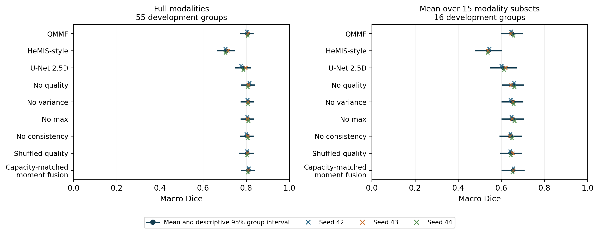

The complete matrix does not establish a quality-conditioning benefit. No quality has higher full-modality and mean-subset point estimates than QMMF in every seed. Its three-seed means are 0.8106 and 0.6551, compared with QMMF's 0.8052 and 0.6492. Capacity-matched moment fusion has the highest mean worst-subset score, 0.3591 versus QMMF's 0.3407. These development findings remain reportable irrespective of the reserved-cohort results.

### Paired main-study ablations

Each contrast retains all three training seeds inside each of **10,000 paired group-bootstrap draws**, seed 20260909. The table shows QMMF minus each control with Bonferroni percentile intervals for eight controls **separately per endpoint**. Full-modality draws use 55 groups; robustness draws use 16. These intervals are descriptive and conditional on the observed training seeds, fold and conservative grouping. They do not estimate uncertainty from new patients or independently repeated training sets.

| Control (QMMF minus control) | Full difference [adjusted interval] | Mean-subset difference [adjusted interval] | Worst-subset difference [adjusted interval] |
|---|---|---|---|
| HeMIS-style | +0.0980 [+0.0750, +0.1246] | +0.1089 [+0.0716, +0.1381] | +0.1069 [-0.0119, +0.1711] |
| U-Net 2.5D | +0.0187 [+0.0059, +0.0343] | +0.0384 [+0.0178, +0.0622] | +0.0495 [+0.0179, +0.0888] |
| No quality | -0.0054 [-0.0135, +0.0029] | -0.0059 [-0.0155, +0.0019] | -0.0130 [-0.0316, +0.0033] |
| No variance | -0.0021 [-0.0110, +0.0059] | -0.0021 [-0.0117, +0.0066] | -0.0056 [-0.0177, +0.0061] |
| No max | -0.0014 [-0.0088, +0.0051] | -0.0036 [-0.0122, +0.0028] | -0.0017 [-0.0215, +0.0101] |
| No consistency | +0.0009 [-0.0023, +0.0044] | +0.0050 [+0.0015, +0.0102] | +0.0013 [-0.0050, +0.0087] |
| Shuffled quality | +0.0008 [-0.0062, +0.0107] | +0.0036 [-0.0014, +0.0089] | +0.0161 [+0.0009, +0.0326] |
| Matched moment fusion | -0.0045 [-0.0139, +0.0034] | -0.0057 [-0.0133, +0.0010] | -0.0184 [-0.0335, -0.0035] |

All QMMF-minus-no-quality adjusted intervals include zero. Its unadjusted 95% intervals are [-0.0111, +0.0006] for full modalities, [-0.0130, -0.0002] for mean subsets and [-0.0266, -0.0010] for worst subsets; these should not be mistaken for the adjusted comparison family. The matched-moment control's worst-subset advantage remains visible after the declared adjustment: QMMF minus control is -0.0184 [-0.0335, -0.0035].

There is narrower component evidence for consistency on the mean-subset endpoint (+0.0050 [+0.0015, +0.0102]) and correct versus shuffled quality on the worst-subset endpoint (+0.0161 [+0.0009, +0.0326]). The latter comparison changes direction across seeds and its group interval conditions on those fixed seeds. Neither finding establishes an advantage over removing quality entirely. Variance and max-pooling removal intervals include zero at all three endpoints.

Cross-family full and mean-subset contrasts favor QMMF over HeMIS-style and U-Net under the declared adjustment; the worst-subset HeMIS interval includes zero. These are comparisons of complete architectures and training objectives, including the auxiliary-head difference, and cannot isolate quality or fusion as the cause.

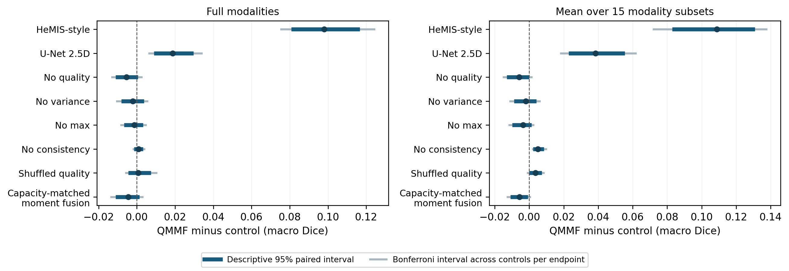

Every seed-specific value, all 24 combined contrasts with both unadjusted and adjusted bounds, and all nine models remain in `results/segmentation_main/`. The three `results/segmentation_study_s42/`, `segmentation_study_s43/` and `segmentation_study_s44/` folders retain the independently checked case/region/subset tables and per-seed analyses. All three execution ledgers contain no pending variants or failures and record no reserved-cohort access during development.

### Regional scores and empty-reference failures

The table shows mean +/- sample seed SD of equal-group regional Dice among cases whose corresponding reference region is nonempty. WT and TC use 91 cases/55 groups; ET uses 89 cases/53 groups. Different denominators and the case-first primary reduction mean that averaging these three regional columns does not reproduce the headline macro Dice.

| Model | WT, 91 cases / 55 groups | TC, 91 cases / 55 groups | ET, 89 cases / 53 groups |
|---|---|---|---|
| QMMF | 0.8639 +/- 0.0048 | 0.7840 +/- 0.0073 | 0.7741 +/- 0.0051 |
| HeMIS-style | 0.8026 +/- 0.0032 | 0.6835 +/- 0.0082 | 0.6429 +/- 0.0120 |
| U-Net 2.5D | 0.8397 +/- 0.0086 | 0.7623 +/- 0.0111 | 0.7659 +/- 0.0130 |
| No quality | 0.8637 +/- 0.0014 | 0.7912 +/- 0.0064 | 0.7824 +/- 0.0088 |
| No variance | 0.8633 +/- 0.0018 | 0.7863 +/- 0.0020 | 0.7773 +/- 0.0019 |
| No max | 0.8637 +/- 0.0017 | 0.7856 +/- 0.0068 | 0.7752 +/- 0.0020 |
| No consistency | 0.8642 +/- 0.0030 | 0.7831 +/- 0.0086 | 0.7724 +/- 0.0037 |
| Shuffled quality | 0.8612 +/- 0.0023 | 0.7833 +/- 0.0085 | 0.7736 +/- 0.0091 |
| Matched moment fusion | 0.8644 +/- 0.0035 | 0.7946 +/- 0.0026 | 0.7745 +/- 0.0108 |

Every one of the 27 fits predicts nonempty WT, TC and ET for every development case. For ET, **both cases with an empty reference have a false-positive prediction for every model and seed**. Their saved empty-reference Dice is zero, but the primary macro excludes reference-empty regions under the frozen rule; this failure is therefore reported separately. There are no empty WT or TC references. `regional_results_by_seed.csv` preserves all counts; `regional_summary.csv` is a descriptive aggregation of the verified per-seed regional tables.

### Training selection and execution costs

Selected epochs below are one-based and come exclusively from the frozen inner-validation composite. All fits reached the 120-epoch budget. U-Net seed 42, no-quality seed 44 and matched-moment seeds 43/44 selected their final validation checkpoint. A complete budget, a late selected checkpoint or a small recent score change does not establish convergence.

| Model | Selected epoch, seed 42 | Seed 43 | Seed 44 |
|---|---|---|---|
| QMMF | 80 | 90 | 110 |
| HeMIS-style | 110 | 80 | 100 |
| U-Net 2.5D | 120 | 90 | 110 |
| No quality | 110 | 90 | 120 |
| No variance | 80 | 90 | 110 |
| No max | 80 | 90 | 110 |
| No consistency | 80 | 90 | 110 |
| Shuffled quality | 80 | 110 | 70 |
| Matched moment fusion | 110 | 120 | 120 |

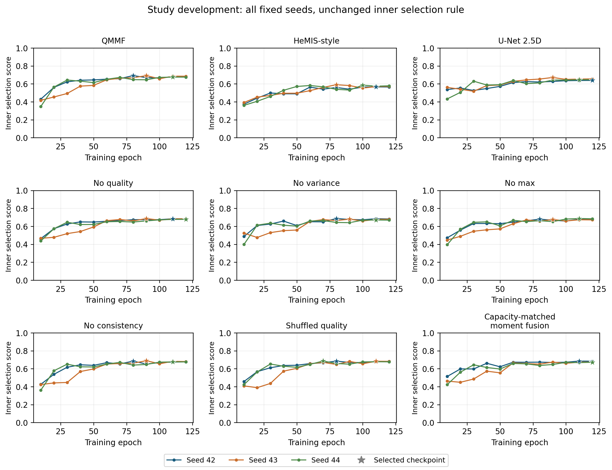

| Model | Parameters | Peak allocated GPU memory (GiB), maximum across seeds |
|---|---|---|
| QMMF | 1,221,465 | 1.347 |
| HeMIS-style | 881,395 | 0.746 |
| U-Net 2.5D | 884,299 | 0.421 |
| No quality | 1,220,569 | 1.347 |
| No variance | 1,183,769 | 1.088 |
| No max | 1,183,769 | 1.283 |
| No consistency | 1,221,465 | 1.332 |
| Shuffled quality | 1,221,465 | 1.347 |
| Matched moment fusion | 1,227,977 | 1.188 |

Detailed median fit/validation and evaluation times are in `resource_summary.csv`; all 27 histories and stopping/selection diagnostics are retained. Model workers overlap and concurrency changes near the end of a job, so these costs do not provide an isolated architecture-speed ranking. First main outer results were reviewed at 2026-09-09 01:03:49 UTC; the final seed was first reviewed after its independent verification at 07:44 UTC. The main source, all declared seeds, inner selection and reserved model set were unchanged.

### Completed reserved-cohort evaluation

The four-model, three-seed comparison was frozen before main outcomes and submitted at 2026-09-09 07:44 UTC after all 27 development fits passed verification. [The private evaluation job](https://www.kaggle.com/code/dasshovon/mri-segmentation-protected-evaluation), version **1**, completed with source SHA-256 `8d04967ff49387a9225764107687138f8ba1f208067cf1fa050adf0dd8e621a9`. All **12/12 existing checkpoint evaluations** passed independent quantitative and qualitative verification and were first reviewed at 11:13 UTC. No model was retrained, normalizer refitted, threshold tuned or checkpoint reselected.

The complete cohort contains 66 cases/51 conservative image groups. Full-modality scores average case macros within groups, then weight groups equally. All 15 modality subsets use 51 frozen group representatives. The source records 2,376 full case/region rows and 9,180 case/subset macro scores, with every planned model, seed and subset present. Reference-empty regions remain excluded from case macro Dice under the frozen rule and are reported separately below.

| Model | Full Dice mean +/- seed SD | Mean-subset Dice | Worst-subset Dice |
|---|---|---|---|
| QMMF | 0.7689 +/- 0.0055 | 0.6322 +/- 0.0080 | 0.3672 +/- 0.0120 |
| HeMIS-style | 0.6837 +/- 0.0007 | 0.5462 +/- 0.0080 | 0.2748 +/- 0.0286 |
| No quality | 0.7769 +/- 0.0007 | 0.6405 +/- 0.0075 | 0.3886 +/- 0.0137 |
| U-Net 2.5D | 0.7621 +/- 0.0074 | 0.6034 +/- 0.0078 | 0.3140 +/- 0.0115 |

The table reports mean +/- sample SD across training seeds. QMMF's descriptive 95% group interval is [0.7346, 0.8009] for full modalities; no quality is [0.7425, 0.8085]. These marginal intervals are not the paired-difference intervals. Repeated seeds share the same evaluation groups and do not create additional independent cohorts.

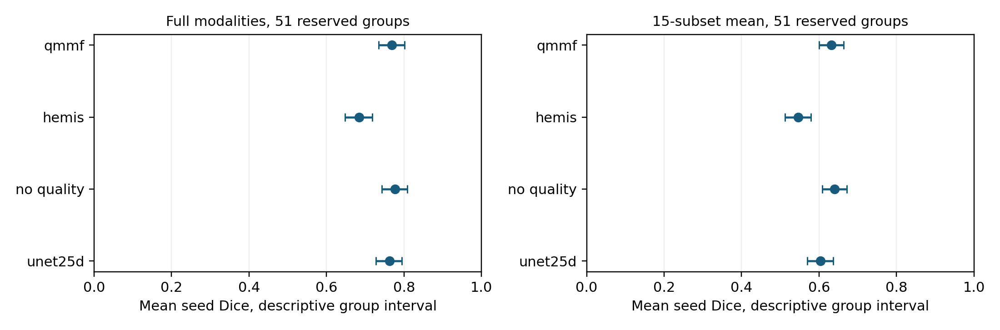

### Reserved paired comparisons

Each of 10,000 paired group-bootstrap draws retains all three fixed training seeds; seed SD is reported separately. Intervals below apply the frozen Bonferroni adjustment for three QMMF-control comparisons **separately per endpoint**. Both unadjusted and adjusted intervals remain in `paired_repeated_seed_deltas.csv`.

| Control (QMMF minus control) | Full difference [adjusted interval] | Mean-subset difference [adjusted interval] | Worst-subset difference [adjusted interval] |
|---|---|---|---|
| HeMIS-style | +0.0853 [+0.0712, +0.0993] | +0.0861 [+0.0734, +0.1003] | +0.0923 [+0.0617, +0.1258] |
| No quality | -0.0080 [-0.0133, -0.0028] | -0.0083 [-0.0124, -0.0042] | -0.0214 [-0.0322, -0.0119] |
| U-Net 2.5D | +0.0068 [-0.0045, +0.0189] | +0.0289 [+0.0210, +0.0375] | +0.0532 [+0.0355, +0.0738] |

**The reserved evaluation favors removing quality conditioning.** QMMF minus no quality is -0.0080 full Dice, -0.0083 mean-subset Dice and -0.0214 worst-subset Dice, with all three adjusted intervals below zero. The no-quality control has a higher full-modality point estimate in each training seed. This supports a negative finding for the implemented descriptors and training schedule; it does not establish that every possible quality-aware method is inferior.

QMMF exceeds HeMIS-style on all three endpoints under this adjustment. Its full-modality comparison with U-Net remains uncertain, while mean- and worst-subset differences favor QMMF. Cross-family comparisons include architecture and auxiliary-loss differences and cannot isolate the quality module. The complete nine-model development study remains reported above; the reserved set was not expanded to include whichever development variant ranked first.

### All modality combinations and attribution

Every entry below is equal-group mean macro Dice across three seeds on the same **51 representatives**. The all-four row therefore uses one case per group; it differs slightly from the headline full-modality endpoint, which incorporates all 66 cases within their groups. In particular, QMMF is 0.7705 on representatives versus 0.7689 on the full cohort. This denominator distinction is preserved throughout the analysis.

| Available modalities | QMMF | HeMIS-style | No quality | U-Net 2.5D |
|---|---|---|---|---|
| t1 | 0.3921 | 0.3096 | 0.4089 | 0.3398 |
| t1ce | 0.6027 | 0.4976 | 0.6071 | 0.5194 |
| t2 | 0.5003 | 0.4154 | 0.5054 | 0.4778 |
| flair | 0.5380 | 0.4631 | 0.5481 | 0.5282 |
| t1+t1ce | 0.6274 | 0.4980 | 0.6382 | 0.5740 |
| t1+t2 | 0.5464 | 0.4799 | 0.5529 | 0.5225 |
| t1+flair | 0.5790 | 0.5001 | 0.5855 | 0.5635 |
| t1ce+t2 | 0.7314 | 0.6559 | 0.7391 | 0.6895 |
| t1ce+flair | 0.7525 | 0.6311 | 0.7589 | 0.7214 |
| t2+flair | 0.5853 | 0.5355 | 0.5921 | 0.5702 |
| t1+t1ce+t2 | 0.7323 | 0.6458 | 0.7464 | 0.7062 |
| t1+t1ce+flair | 0.7560 | 0.6422 | 0.7651 | 0.7419 |
| t1+t2+flair | 0.5978 | 0.5595 | 0.6062 | 0.5809 |
| t1ce+t2+flair | 0.7718 | 0.6746 | 0.7754 | 0.7520 |
| t1+t1ce+t2+flair | 0.7705 | 0.6845 | 0.7788 | 0.7634 |

No quality has the higher three-seed mean in all 15 combinations. These per-combination values are descriptive; no additional family of significance tests is claimed. Robustness remains limited: for QMMF, T1 alone yields 0.3921 and the average case-specific worst subset yields 0.3672. The latter can be lower than every column mean because different cases can have different worst combinations. Missingness is simulated by masking channels after complete-volume preprocessing; these results do not validate an acquisition workflow that never obtains the missing sequences.

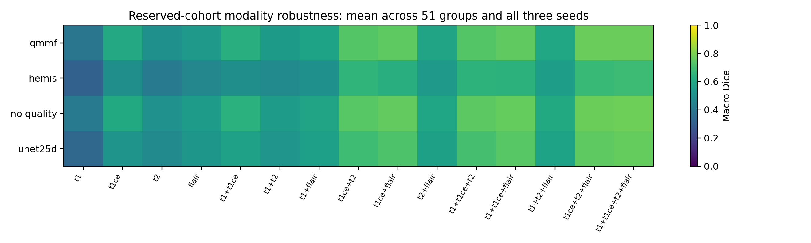

Exact macro-Dice Shapley attribution uses all 15 nonempty subsets and a **declared empty-set utility of zero**, without an empty-input model prediction. The following means weight the same 51 representatives and three seeds equally; per-seed values and sample SD are in `reporting/modality_shapley_summary.csv`.

| Model | T1 | T1ce | T2 | FLAIR |
|---|---|---|---|---|
| QMMF | 0.1084 | 0.2964 | 0.1681 | 0.1976 |
| HeMIS-style | 0.0904 | 0.2426 | 0.1687 | 0.1827 |
| No quality | 0.1150 | 0.2975 | 0.1686 | 0.1978 |
| U-Net 2.5D | 0.1030 | 0.2740 | 0.1727 | 0.2136 |

T1ce has the largest mean attribution for each model under this convention. Contributions sum to each model's all-four representative score, not its 66-case headline score. They describe model utility under the masking protocol, not causal clinical or scanner importance. Learned-gate alignment and experimentally controlled scanner-quality effects were not measured.

### Reserved regional scores and empty-reference failures

These regional means +/- seed SD include only nonempty references, weighting groups equally. WT and TC use all 66 cases/51 groups; ET uses 64 cases/49 groups. Their denominators differ from the case-first headline macro and must not be averaged to reconstruct it.

| Model | WT, 66 cases / 51 groups | TC, 66 cases / 51 groups | ET, 64 cases / 49 groups |
|---|---|---|---|
| QMMF | 0.8740 +/- 0.0050 | 0.7688 +/- 0.0134 | 0.6625 +/- 0.0071 |
| HeMIS-style | 0.8372 +/- 0.0030 | 0.6864 +/- 0.0012 | 0.5214 +/- 0.0070 |
| No quality | 0.8769 +/- 0.0005 | 0.7872 +/- 0.0039 | 0.6647 +/- 0.0050 |
| U-Net 2.5D | 0.8543 +/- 0.0079 | 0.7674 +/- 0.0051 | 0.6628 +/- 0.0117 |

**BRATS_023 and BRATS_027 have empty ET references. Every model and seed predicts nonempty ET for both cases.** All 12 checkpoint evaluations also predict nonempty WT and TC for every case. The ET false positives are recorded as zero empty-reference Dice, but the primary case macro excludes those reference-empty regions. The separate failure count is therefore necessary to interpret the headline results. There are no empty WT or TC references. Surface-distance metrics such as HD95 were outside this frozen evaluation.

### Fixed qualitative examples

Amendment 9 fixed BRATS_143, BRATS_119 and BRATS_023, seed 42, all four models and the maximum-reference-WT-area axial slice rule before revised reserved outcomes. These are the actual retrieved MRI-derived panels. Their source/checkpoint identity, common inputs, slice indices, orientation, mask areas, PNG hashes and whole-volume Dice captions passed verification. Only figure spacing was adjusted locally for legibility; original tiles, model outputs, case selection and metrics were unchanged.

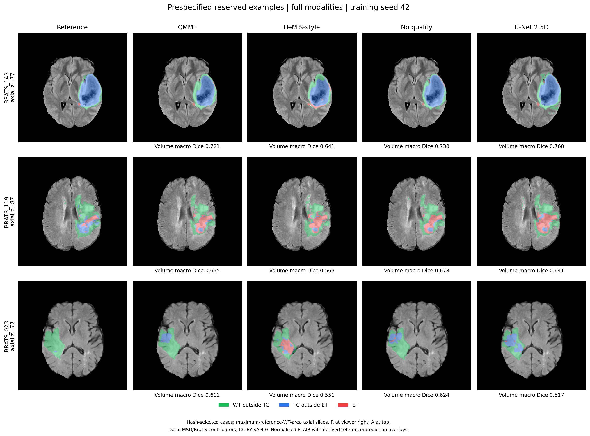

The figure's scores are whole-volume case macro Dice, not selected-slice scores:

| Case (axial index) | QMMF | HeMIS-style | No quality | U-Net 2.5D |
|---|---|---|---|---|
| BRATS_143 (77) | 0.7211 | 0.6408 | 0.7303 | 0.7596 |
| BRATS_119 (87) | 0.6555 | 0.5635 | 0.6782 | 0.6412 |
| BRATS_023 (77) | 0.6109 | 0.5506 | 0.6242 | 0.5172 |

BRATS_023 illustrates excess predicted tumor-core components despite a mainly WT reference on the shown slice; its whole-volume ET reference is empty. The fixed examples contain visible errors and were not selected for favorable outcomes. They cannot establish population performance or independent historical validation: BRATS_143 was among the original notebook's recorded validation cases. Green shows WT outside TC, blue TC outside ET and red ET, over normalized FLAIR; R is at viewer right and A at the top. The figure and its original tiles retain [MSD attribution and CC BY-SA 4.0 terms](../results/segmentation_protected/qualitative/ATTRIBUTION.md).

### Exploratory historical-exposure sensitivity

The separately frozen metadata rule retains **15 complete groups/18 full-modality cases**, all outside the original development partition, plus their 15 existing robustness representatives. All four models, three seeds, endpoints and checkpoint identities remain. This analysis was specified after two main seeds had been reviewed and before any revised reserved result. It reads verified metric tables and performs no new inference or training. Its verifier reconstructs membership and reproduces the complete 51-group summaries and paired intervals before filtering.

| Model | Full Dice mean +/- seed SD | Mean-subset Dice | Worst-subset Dice |
|---|---|---|---|
| QMMF | 0.7897 +/- 0.0058 | 0.6300 +/- 0.0088 | 0.3371 +/- 0.0169 |
| HeMIS-style | 0.7065 +/- 0.0038 | 0.5320 +/- 0.0034 | 0.2192 +/- 0.0230 |
| No quality | 0.7921 +/- 0.0061 | 0.6366 +/- 0.0142 | 0.3550 +/- 0.0209 |
| U-Net 2.5D | 0.7748 +/- 0.0093 | 0.5978 +/- 0.0092 | 0.3040 +/- 0.0237 |

The paired table uses the same 10,000 draws and three controls per endpoint, now resampling 15 groups:

| Control (QMMF minus control) | Full difference [adjusted interval] | Mean-subset difference [adjusted interval] | Worst-subset difference [adjusted interval] |
|---|---|---|---|
| HeMIS-style | +0.0832 [+0.0644, +0.1050] | +0.0980 [+0.0752, +0.1227] | +0.1179 [+0.0688, +0.1649] |
| No quality | -0.0024 [-0.0107, +0.0080] | -0.0067 [-0.0168, +0.0018] | -0.0178 [-0.0437, -0.0016] |
| U-Net 2.5D | +0.0148 [-0.0056, +0.0361] | +0.0321 [+0.0181, +0.0474] | +0.0331 [+0.0155, +0.0522] |

QMMF-minus-no-quality full Dice is -0.0024, adjusted interval [-0.0107, +0.0080]; mean-subset Dice is -0.0067 [-0.0168, +0.0018]. Both differences remain uncertain. Worst-subset Dice favors no quality: -0.0178 [-0.0437, -0.0016]. Thus the smaller sensitivity does not establish a quality benefit and retains a worst-subset disadvantage. It is too small and selectively eligible to settle generalization, historical exposure effects or patient independence.

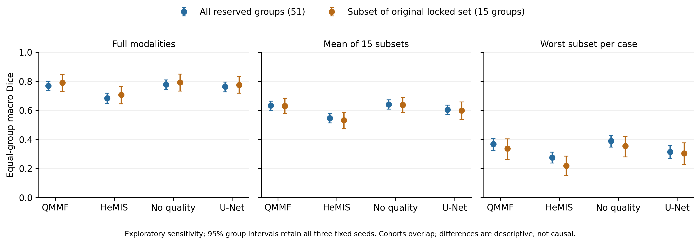

The 15-group cohort is nested within the 51-group cohort. Differences between their scores are descriptive and cannot be attributed causally to historical exposure. The full planned report remains intact; the smaller subset is explicitly exploratory. `results/segmentation_historical_sensitivity/` retains 12 summary rows, nine paired contrasts, 36 seed-specific endpoint rows, selected group tables and input/output hashes.

### Reserved execution cost and final evidence scope

The inference job's completed ledger records **12,220.51 seconds (3.39 session hours)** with two T4 devices allocated, no failures and no pending checkpoints. Each model's median below covers full and subset evaluation with its selected checkpoint; the timers include any qualitative work and exclude setup before the worker timer. Workers overlap, so their sum is not session elapsed time or measured GPU busy time.

| Model | Median evaluation-attempt seconds | Peak allocated GPU GiB | Three illustrative-case inferences, seconds |
|---|---|---|---|
| QMMF | 2253.56 | 0.597 | 8.23 |
| HeMIS-style | 1803.46 | 0.436 | 6.71 |
| No quality | 2252.69 | 0.597 | 8.28 |
| U-Net 2.5D | 1661.83 | 0.312 | 6.30 |

The 12 additional illustrative-case inferences used approximately 29.52 seconds summed across worker timers and are included in those attempts. At 11:12 UTC, the account quota reported 86,606.589 GPU seconds used out of 108,000 (24.06 of 30 hours), zero reserved, resetting 2026-09-12 00:00 UTC. Account quota is a different accounting measure from the experiment ledgers. No further GPU run is required by this completed protocol.

The completed evidence supports a reproducible internal benchmark and a negative quality-conditioning result. It does not establish external clinical generalization, verified patient independence, novelty or superiority to unreproduced contemporary volumetric methods. Historical validation overlap, conservative grouping, restricted test eligibility, the single development fold, complete-volume preprocessing before masking and ET-empty false positives limit the claim. A paper should present those limitations and the negative controls explicitly, with any broader comparator or independent cohort study specified as future work.

The local suite had **145 passing tests** at main-study submission. The current full suite has **186 passing tests**, adding protected-evaluation, queue-accounting, training-history and qualitative-figure checks. It covers actual-crop-size fp16 reductions, inference normalization, channel order, missing-modality isolation, full teacher input, group isolation, uniform group sampling, cross-group quality donors, correct group aggregation, paired bootstrap alignment, preserved fingerprint CSV text and aligned capacity matching. The history checks reject an altered composite, missed validation, missing epochs, premature completion and ignored early stopping. Figure checks reject a changed case, seed, checkpoint, slice, score, input or PNG, and verify RAS orientation and visible false positives outside brain support. Eleven added checks cover historical cohort selection, complete source-table coverage, preservation of every seed/model and rejection of invalid source rows or incomplete verification. These fixtures never load protected MRI and do not establish real segmentation accuracy.

## Run failures and historical provenance

| Job | Version | Evidence |
|---|---|---|
| Classification | 1 | Failed before training: incorrect accelerator identifier fell back to P100; installed PyTorch wheel lacked its architecture. Audit and split outputs were produced. |
| Classification | 2 | Complete: 105 runs and 4,788 OOF rows, with every declared model/fold/seed present. |
| Segmentation CPU preparation | 1 | Complete: 484 structurally valid volumes and caches; subsequent review exposed case-ID split leakage. |
| Segmentation pilot | 1 | Cancelled after the overlap discovery; zero completed fits and no held-out scores. |
| Segmentation similarity audit | 1 | Completed; float32 normalization slightly exceeded valid correlation bounds, so numerical values were rejected. |
| Segmentation similarity audit | 2 | Complete float64 rerun; bounded correlations and 262 conservative groups verified. |
| Segmentation pilot | 2 | Complete: three fresh fits, frozen group partitions and independently verified group-weighted primary metrics. |
| Lossless training-cache conversion | 1 | Complete: all 484 images/targets verified voxel-for-voxel, with a checked archive inventory. |
| Training I/O benchmark | 1 | Complete: QMMF 4.02× and HeMIS-style 3.51× measured segment speedups; weights discarded. |
| Main segmentation, seed 42 | 1 | Complete and independently verified: all nine variants, 120×100 training per fit, full outer and 15-subset evaluations. |
| Main segmentation, seed 43 | 1 | Complete and independently verified: the same full protocol, independent training seed. |
| Main segmentation, seed 44 | 1 | Complete and independently verified: all nine variants; the complete 27-fit matrix passed its gate. |
| Reserved-cohort evaluation | 1 | Complete and independently verified: all 12 checkpoints, 66 cases/51 groups, all 15 subsets and 12 real prediction panels. Frozen historical sensitivity also completed locally. |

The initial six-hour quota interpretation was an SDK serialization error. The typed API response confirms **30 GPU hours**, resetting 2026-09-12 00:00 UTC. At the 17:16 UTC check, 500.074 seconds had been used and none were reserved. `scripts/kaggle_api.py quota` now retains whole days and fractional seconds. CPU preprocessing preserves the GPU allowance. Failed attempts are retained and are not successful experiments.

The input classification notebook reported MSCANet accuracy 0.8158 +/- 0.0806 and macro F1 0.8046 +/- 0.0836 over five folds; its narrow ResNet reported accuracy 0.8206 +/- 0.0533 and macro F1 0.8052 +/- 0.0581. Those are historical outputs. New similarity grouping, preprocessing, repeated seeds and aggregation differ, so the old/new change is not a controlled estimate of one repair. The input segmentation notebook stops during training and supplies no final test result.
